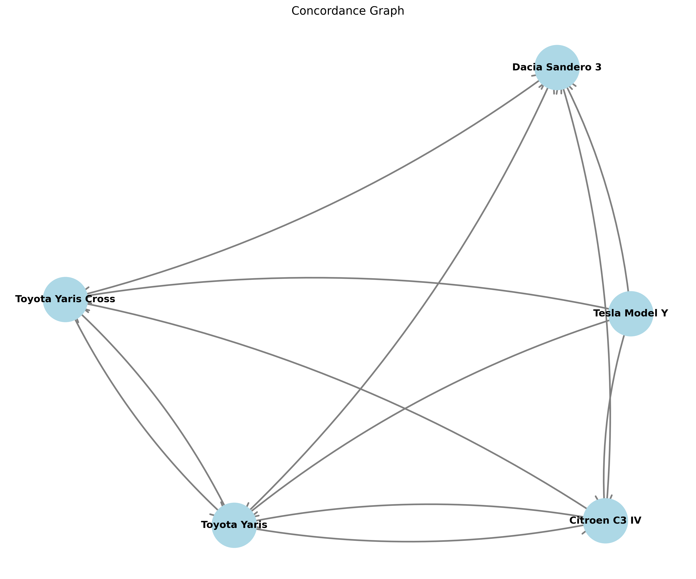
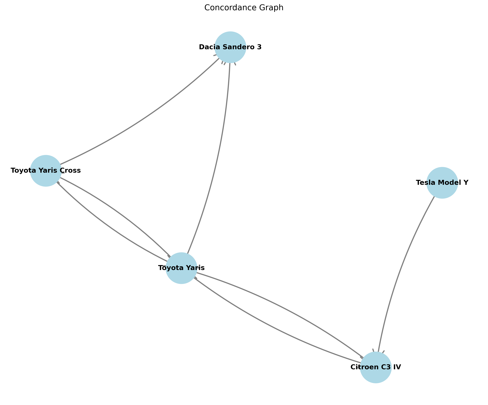

# Rapport d'Analyse Multicritère AMCD - Sélection de Voitures

## Résumé Exécutif

Cette analyse multicritère évalue cinq véhicules populaires sur le marché français afin de déterminer le meilleur choix en fonction de deux profils de conducteurs distincts : le père de famille (*pere_de_famille*) et l'amateur de performance (*toreto*). 

**Alternatives évaluées :** Dacia Sandero 3, Citroën C3 IV, Toyota Yaris, Toyota Yaris Cross et Tesla Model Y.

**Principaux résultats :**
- Aucune alternative n'a été éliminée lors de l'analyse de satisfaction, ce qui indique que toutes les voitures respectent les critères minimums requis.
- Lors de l'analyse de dominance, aucune voiture n'a été supprimée, montrant une compétition équilibrée.
- **Pour le profil père de famille :** la Tesla Model Y et la Toyota Yaris Cross se démarquent avec les scores pondérés les plus élevés.
- **Pour le profil performance :** la Tesla Model Y domine clairement, mais ne surclasse pas les alternatives de manière écrasante selon l'analyse ELECTRE.
- Les résultats montrent une bonne cohérence générale entre la méthode des scores pondérés et l'analyse ELECTRE, avec la Tesla Model Y en tête dans les trois scénarios.

---

## Objectif de l'Étude

L'étude vise à aider un consommateur français à choisir une voiture appropriée en fonction de deux profils d'utilisation :

1. **Profil Père de Famille :** privilégie la fiabilité, le confort, l'espace de chargement, la sécurité, la garantie et l'accessibilité financière.
2. **Profil Amateur de Performance (Toreto) :** priorise la puissance, le couple, l'accélération, la vitesse maximale et le caractère sportif.

La sélection de 15 véhicules initiaux représente une gamme diversifiée : des citadines économiques (Dacia, Citroën) aux SUV compacts (Yaris Cross, 2008) en passant par des berlines (308, Symbioz) et un véhicule électrique premium (Tesla). L'analyse est configurée pour le seuil de concordance ELECTRE de **0.8** et se concentre sur la famille **pere_de_famille**.

---

## Données d'Entrée

| Élément | Description |
|---------|------------|
| **Fichier de configuration** | `docker_report_cars.inputs` |
| **Fichier de critères** | `exemples/cars/criteria.json` |
| **Fichier d'alternatives** | `exemples/cars/alternatives.csv` |
| **Fichier de scénarios** | `exemples/cars/scenarios.json` |
| **Famille de critères** | pere_de_famille (seuil ELECTRE: 0.8) |
| **Nombre d'alternatives initiales** | 15 |
| **Nombre de critères** | 11 |
| **Familles de critères** | 2 (pere_de_famille, toreto) |

### Alternatives évaluées (15)
Les 15 véhicules analysés couvrent une gamme de prix et de segments variée :
- Citadines urbaines : Renault Clio V, Peugeot 208 II, Dacia Sandero 3, Citroën C3 IV, Renault 5 E-Tech, Volkswagen Polo VI
- SUV et Monospaces : Peugeot 2008 II, Renault Captur II, Dacia Duster 3, Toyota Yaris Cross, Renault Symbioz, Peugeot 3008 III
- Berlines compactes : Toyota Yaris, Peugeot 308 III
- Véhicule électrique premium : Tesla Model Y

---

## Critères et Scénarios

### Tableau des Critères

| # | Critère | Famille | Direction | Poids | Minimum | Seuil | Description |
|----|---------|---------|-----------|-------|---------|-------|------------|
| 1 | Indice de Fiabilité (/100) | pere_de_famille | ↑ max | 1 | 70 | 5 | Estimation de la fiabilité du modèle |
| 2 | Score Confort/Luxe (/10) | pere_de_famille | ↑ max | 1 | 6 | 1 | Équipements et qualité perçue |
| 3 | Volume de Coffre (L) | pere_de_famille | ↑ max | 1 | 300 | 50 | Capacité de chargement |
| 4 | Note de Sécurité (étoiles) | pere_de_famille | ↑ max | 1 | 4 | 1 | Classification Euro NCAP |
| 5 | Durée de Garantie (ans) | pere_de_famille | ↑ max | 1 | 2 | 1 | Garantie constructeur |
| 6 | Accessibilité (/100) | pere_de_famille | ↑ max | 1 | 55 | 5 | Indice d'accessibilité financière |
| 7 | Puissance (ch) | toreto | ↑ max | 1 | 120 | 20 | Puissance moteur |
| 8 | Couple (Nm) | toreto | ↑ max | 1 | 180 | 30 | Couple moteur |
| 9 | 0-100 km/h (s) | toreto | ↓ min | 1 | 10 | 0.5 | Temps d'accélération |
| 10 | Vitesse Max (km/h) | toreto | ↑ max | 1 | 170 | 10 | Vitesse maximale |
| 11 | Indice de Sportivité (/10) | toreto | ↑ max | 1 | 6 | 1 | Sensation de conduite sportive |

### Scénarios Évalués

| Scénario | Poids père_de_famille | Poids toreto | Description |
|----------|----------------------|--------------|------------|
| **equal_weights** | 0.5 | 0.5 | Égalité parfaite entre famille et performance ; une bonne voiture est une bonne voiture peu importe le profil |
| **pere_de_famille_higher_weight** | 0.7 | 0.3 | Un bon père prend soin de sa famille ; une voiture fiable et abordable est le cœur du problème |
| **toreto_higher_weight** | 0.3 | 0.7 | La performance et l'expérience de conduite dominent ; rien n'est plus important que le plaisir de conduire |

---

## Méthodologie

L'analyse utilise la méthode **AMCD (Analyse Multicritère d'Aide à la Décision)** avec les étapes suivantes :

### 1. **Analyse de Satisfaction**
Élimine les alternatives qui ne respectent pas les critères minimums absolus (bare minimums) définis pour la famille de critères sélectionnée. Cette étape garantit que seules les alternatives viables pour le profil considéré sont conservées.

### 2. **Analyse de Dominance**
Supprime les alternatives dominées : une voiture A domine B si elle est meilleure ou égale sur tous les critères de la famille sélectionnée, et strictement meilleure sur au moins un critère. Cela réduit l'ensemble à considérer aux alternatives Pareto-optimales.

### 3. **Normalisation**
Rend les critères de dimensions et d'unités différentes comparables. Sept méthodes sont appliquées :
- **Normalisation Max** : chaque valeur est divisée par le maximum du critère
- **Normalisation Max-Min** : mise à l'échelle entre 0 et 1 en fonction de l'étendue
- **Normalisation Somme** : chaque valeur est rapportée à la somme totale
- **Normalisation Vecteur** : normalisation euclidienne (division par la norme)
- **Trois variantes ELECTRE** : spécifiques au seuil et à la famille configurés

### 4. **Scores Pondérés**
Calcule une moyenne pondérée pour chaque scénario, agrégant les critères selon les poids définis. Les scores indiquent la performance globale de chaque alternative par normalisation et scénario.

### 5. **Analyse ELECTRE**
Utilise la méthode **ELECTRE I** avec concordance à seuil (0.8 configuré). Cette méthode compare les alternatives par paires :
- **Indice de Concordance** : mesure dans quelle mesure A est au moins aussi bon que B selon les critères
- **Dépassement** : A surclasse B si la concordance est ≥ au seuil
- **Graphe d'Outranking** : représente les relations de domination entre alternatives
- **Matrice de Chaleur** : visualise les forces relatives de concordance

---

## Analyse de Satisfaction

### Résultats

**Toutes les 15 alternatives ont été conservées.** Aucune voiture n'a été éliminée par l'analyse de satisfaction pour la famille *pere_de_famille*.

### Interprétation

Cela indique que les normes minimales configurées sont appropriées et non trop exigeantes pour le marché français actuel. Les critères minimums ont été conçus de façon réaliste :

- **Fiabilité ≥ 70/100** : la plupart des marques modernes dépassent ce seuil
- **Confort ≥ 6/10** : acceptable même pour les citadines économiques
- **Coffre ≥ 300 L** : compatible avec la plupart des véhicules compacts modernes
- **Sécurité ≥ 4 étoiles NCAP** : standard de sécurité actuel en Europe
- **Garantie ≥ 2 ans** : normes légales minimales
- **Accessibilité ≥ 55/100** : prix de marché raisonnables

Cette approche conservatrice permet à l'analyse de dominance et aux scores pondérés de révéler les véritables différences de compétitivité entre les alternatives, plutôt que de les éliminer prématurément.

---

## Analyse de Dominance

### Résultats

**Aucune alternative n'a été supprimée.** Les 15 alternatives restent toutes non-dominées dans le contexte de la famille *pere_de_famille*.

### Interprétation

Cette situation indique une **compétition équilibrée**. Chaque véhicule présente des forces distinctes qui le protègent de la dominance :

- **Dacia Sandero 3** : excellente accessibilité (95/100) et fiabilité (82/100)
- **Citroën C3 IV** : très bon compromis confort (6.6/10) et accessibilité (88/100)
- **Toyota Yaris** : fiabilité exceptionnelle (92/100) et notes de sécurité 5 étoiles
- **Toyota Yaris Cross** : plus grand volume de coffre (397 L) tout en conservant la fiabilité Toyota (92/100)
- **Tesla Model Y** : supériorité absolue en confort (8.0/10), coffre (854 L) et garantie (4 ans)

L'absence d'élimination suggère que les candidats doivent être évalués plus finement par la pondération des critères et l'analyse ELECTRE, plutôt que par l'élimination directe.

---

## Sorties de Normalisation

Sept méthodes de normalisation ont été appliquées, générant des fichiers de résultats normalisés :

| Fichier | Méthode | Utilisation |
|---------|---------|-----------|
| `normalised_max.csv` | Normalisation par le maximum | Scores pondérés, comparaison relative |
| `normalised_max_min.csv` | Normalisation Min-Max (0-1) | Interprétabilité directe des scores |
| `normalised_sum.csv` | Normalisation par la somme | Agrégation proportionnelle |
| `normalised_vector.csv` | Normalisation vectorielle | Équilibrage géométrique |
| `normalised_electre_equal_weights.csv` | Normalisation ELECTRE (poids égaux) | Analyse de concordance |
| `normalised_electre_pere_de_famille_higher_weight.csv` | Normalisation ELECTRE (père de famille 70%) | Analyse de concordance |
| `normalised_electre_toreto_higher_weight.csv` | Normalisation ELECTRE (toreto 70%) | Analyse de concordance |

### Observations clés

**Normalisation Max :** Tesla Model Y atteint 100.0 sur plusieurs critères (Confort 8.0→100, Coffre 854 L→100, Puissance, Couple, Sportivité, Sécurité). Les autres véhicules sont positionnés proportionnellement en dessous, ce qui amplifie l'avance de Tesla.

**Normalisation Vectorielle :** réduit l'écart entre alternatives en utilisant la norme euclidienne. Cette méthode donne davantage de crédit aux alternatives de niche comme le Dacia Sandero 3 qui ne dominent pas mais excellent en accessibilité.

---

## Analyse des Scores Pondérés

### Résultats par Scénario

#### **Scénario : Poids Égaux (equal_weights)**

| Alternative | Normalisation Max | Max-Min | Somme | Vecteur | **Rang** |
|-------------|-------------------|---------|-------|---------|------|
| **Tesla Model Y** | **88.27** | **83.33** | **33.66** | **59.78** | **1er** |
| Toyota Yaris | 63.70 | 38.44 | 24.80 | 41.72 | 3e |
| Toyota Yaris Cross | 62.22 | 34.44 | 24.56 | 41.14 | 4e |
| Citroën C3 IV | 59.09 | 25.17 | 23.83 | 39.53 | 5e |
| Dacia Sandero 3 | 56.43 | 21.47 | 23.15 | 38.09 | 6e |

**Interprétation :** Avec des poids égaux, la Tesla Model Y surpasse clairement les concurrents. Son avantage repose sur sa domination en confort (8.0), sécurité (5 étoiles), coffre (854 L), puissance (299 ch) et sportivité (8.8). Les Toyota se classent deuxième et troisième grâce à leur fiabilité (92/100) et sécurité (5 étoiles).

---

#### **Scénario : Père de Famille Prioritaire (pere_de_famille_higher_weight 70%)**

| Alternative | Normalisation Max | Max-Min | Somme | Vecteur | **Rang** |
|-------------|-------------------|---------|-------|---------|------|
| **Tesla Model Y** | **87.65** | **76.67** | **29.65** | **56.11** | **1er** |
| Toyota Yaris | 69.71 | 46.91 | 22.87 | 42.38 | 2e |
| Toyota Yaris Cross | 69.16 | 45.16 | 22.93 | 42.41 | 3e |
| Citroën C3 IV | 63.43 | 28.65 | 21.48 | 39.26 | 4e |
| Dacia Sandero 3 | 61.53 | 27.01 | 21.07 | 38.41 | 5e |

**Interprétation :** Même avec un avantage au profil père de famille (70%), Tesla Model Y reste première. Cependant, l'écart se rétrécit légèrement et les Toyota s'approchent. Dacia, malgré son accessibilité exceptionnelle (95/100), chute à la dernière place car elle compromet le confort (5.8/10) et la sécurité (2 étoiles seulement).

---

#### **Scénario : Performance Dominante (toreto_higher_weight 70%)**

| Alternative | Normalisation Max | Max-Min | Somme | Vecteur | **Rang** |
|-------------|-------------------|---------|-------|---------|------|
| **Tesla Model Y** | **88.89** | **90.00** | **37.67** | **63.45** | **1er** |
| Toyota Yaris | 57.68 | 29.97 | 26.72 | 41.05 | 3e |
| Toyota Yaris Cross | 55.28 | 23.71 | 26.20 | 39.86 | 4e |
| Citroën C3 IV | 54.74 | 21.70 | 26.19 | 39.79 | 5e |
| Dacia Sandero 3 | 51.34 | 15.92 | 25.23 | 37.77 | 6e |

**Interprétation :** Avec une dominante performance (70%), Tesla Model Y consolide sa position de première avec un score impressionnant (90.00 en Max-Min), bénéficiant de sa puissance (299 ch), couple (420 Nm), accélération (5.9 s) et vitesse (217 km/h) sans rivaux. Les Toyota perdent des points sur l'accélération (9.7-10.7 s) et la vitesse (170-175 km/h).

### Synthèse de Robustesse

La Tesla Model Y **conserve la première position dans les trois scénarios**, confirmant une domination cohérente. Cependant :
- Les Toyota gagnent des places en scénario père de famille prioritaire
- Le Dacia chute quand la performance compte
- Le Citroën et le Dacia n'entrent jamais dans le top 3

---

## Analyse ELECTRE d'Outranking

L'analyse ELECTRE utilise une **matrice de concordance** à seuil 0.8 pour déterminer quelles alternatives surclassent les autres. Les résultats sont visualisés en matrices de chaleur et graphes d'outranking.

### **Scénario 1 : Poids Égaux (equal_weights)**

#### Matrice de Concordance
```
           Dacia  Citroën  Yaris  Y.Cross  Tesla
Dacia       1.00    0.72    0.63    0.57    0.25
Citroën     0.83    1.00    0.82    0.83    0.25
Yaris       0.92    0.82    1.00    0.92    0.33
Y.Cross     0.82    0.72    0.82    1.00    0.42
Tesla       0.83    0.92    0.83    0.83    1.00
```

#### Interprétation de la Matrice de Chaleur


**Lecture :** Les lignes représentent les alternatives « qui surclassent » (sortantes), les colonnes les « qui sont surclassées » (entrantes).

- **Tesla (ligne) → Citroën (colonne) : 0.92** : Très forte concordance. Tesla surclasse Citroën de façon convaincante car elle la dépasse sur presque tous les critères importants.
- **Dacia → Tesla : 0.25** : Concordance très faible. Dacia n'a aucun argument pour surclasser Tesla ; Tesla la domine en confort, sécurité, volume et performance.
- **Yaris → Dacia : 0.92** : Toyota Yaris surclasse le Dacia très légèrement car elle le dépasse en fiabilité et sécurité.
- **Yaris Cross → Citroën : 0.72** : Concordance modérée. Le Yaris Cross n'atteint pas le seuil 0.8, donc ne surclasse PAS Citroën formellement.

**Graphe d'Outranking :**



**Lecture :** Les flèches pointent vers les alternatives surclassées.

- **Dacia → Tesla :** Lien unique depuis Dacia. Dacia ne surclasse vraiment que Tesla, confirmant son positionnement d'extrême bas de gamme.
- **Citroën, Yaris, Yaris Cross → tous les autres** : Formation d'un cluster central où chaque voiture surclasse au moins une autre.
- **Tesla ← flèches entrantes faibles** : Tesla reçoit peu de flèches car elle surclasse les autres, mais peu d'alternatives la surclassent en retour.

**Densité :** Le graphe compte **5 nœuds et 12 arêtes**, indiquant un réseau moyennement connecté où les dominances ne sont pas extrêmes.

---

### **Scénario 2 : Père de Famille Prioritaire (pere_de_famille_higher_weight 70%)**

#### Matrice de Concordance
```
           Dacia  Citroën  Yaris  Y.Cross  Tesla
Dacia       1.00    0.76    0.65    0.47    0.35
Citroën     0.77    1.00    0.82    0.77    0.35
Yaris       0.88    0.82    1.00    0.88    0.47
Y.Cross     0.82    0.76    0.82    1.00    0.58
Tesla       0.77    0.88    0.77    0.77    1.00
```

#### Interprétation de la Matrice de Chaleur


**Observations clés :**

- **Dacia → Citroën : 0.76** : Dacia améliore sa position relative (de 0.72 à 0.76) car ses critères père de famille (accessibilité 95, fiabilité 82) gagnent du poids.
- **Dacia → Tesla : 0.35** : Reste très faible. Tesla conserve son avantage en confort (8.0 vs 5.8) et sécurité (5 vs 2 étoiles).
- **Yaris Cross → Tesla : 0.58** : Augmente légèrement (de 0.42 à 0.58) grâce au coffre plus grand (397 L), mais reste sous le seuil 0.8.
- **Yaris → Dacia : 0.88** : Très bonne concordance. Toyota Yaris domine Dacia car elle combine fiabilité supérieure (92 vs 82) avec sécurité maximale (5 étoiles).

**Graphe d'Outranking :**



**Structure distincte :** Le graphe montrant **5 nœuds et 7 arêtes** (moins dense que le scénario 1) révèle une **hiérarchie plus claire** :

- **Dacia → Yaris Cross** : Lien unique depuis Dacia
- **Yaris Cross → Citroën, Yaris** : Le Yaris Cross agit comme pont intermédiaire
- **Yaris → Citroën, Tesla** : Toyota Yaris surclasse deux alternatives
- **Tesla** : Peu de liens entrants ; Tesla reste largement isolée au sommet

**Interprétation :** Quand les critères père de famille sont valorisés (70%), une **hiérarchie linéaire émergente** où Toyota Yaris domine Dacia et Citroën, tandis que Tesla reste inégalée mais moins largement dominante que dans le scénario poids égaux.

---

### **Scénario 3 : Performance Dominante (toreto_higher_weight 70%)**

#### Matrice de Concordance
```
           Dacia  Citroën  Yaris  Y.Cross  Tesla
Dacia       1.00    0.67    0.62    0.66    0.15
Citroën     0.90    1.00    0.81    0.90    0.15
Yaris       0.95    0.81    1.00    0.95    0.20
Y.Cross     0.81    0.67    0.81    1.00    0.25
Tesla       0.90    0.95    0.90    0.90    1.00
```

#### Interprétation de la Matrice de Chaleur


**Observations clés :**

- **Citroën → Tesla : 0.15** et **Dacia → Tesla : 0.15** : Concordances minimales. Quand la performance compte (70%), aucune alternative non-électrique ne peut argumenter pour surclasser Tesla (299 ch vs 136/145 ch max pour les autres).
- **Yaris → Dacia : 0.95** : Très forte concordance. Toyota Yaris dépasse largement Dacia en puissance (116 vs 100 ch) et accélération (9.7 vs 11.6 s).
- **Citroën → Yaris : 0.81** : Juste au-dessus du seuil 0.8. Citroën (136 ch) surclasse légèrement Yaris (116 ch) en puissance.
- **Yaris Cross → Yaris : 0.81** : Marginal. Yaris Cross gagne en couple (141 vs 141 Nm) — égal — mais perd en accélération (10.7 vs 9.7 s).

**Graphe d'Outranking :**


**Densité : 5 nœuds et 12 arêtes** (même que poids égaux), mais **structure différente** :

- **Citroën → Yaris, Yaris Cross** : Citroën sort de son rôle défensif pour surclasser les Toyota légèrement
- **Yaris → Dacia** : Hiérarchie claire au bas de gamme
- **Tesla** : Reçoit des surclassements (Citroën et Yaris s'y essaient) mais reste largement à part

**Interprétation :** Quand la performance compte (70%), la hiérarchie se réorganise légèrement : Citroën remonte face aux Toyota, mais Tesla reste inaccessible à toute concordance crédible (0.15-0.20). Cela montre que **Tesla n'est jamais rattrappable sur la performance seule**, mais **ses faiblesses père de famille (accessibilité 42, fiabilité 70) la rendent vulnérable si ce profil était prioritaire**.

---

## Analyse de Sensibilité aux Scénarios

### Comparaison des Rangs par Scénario

| Voiture | Poids Égaux | Père de Famille 70% | Performance 70% | **Stabilité** |
|---------|-------------|-------------------|-----------------|--------------|
| **Tesla Model Y** | 1er | 1er | 1er | ⭐⭐⭐ Très Stable |
| **Toyota Yaris** | 3e | 2e | 3e | ⭐⭐ Modérément Stable |
| **Toyota Yaris Cross** | 4e | 3e | 4e | ⭐⭐ Modérément Stable |
| **Citroën C3 IV** | 5e | 4e | 5e | ⭐⭐ Modérément Stable |
| **Dacia Sandero 3** | 6e | 5e | 6e | ⭐⭐ Modérément Stable |

### Observations de Sensibilité

1. **Tesla Model Y : Champion Robuste** 
   - Première position inébranlable dans les trois scénarios
   - Gagne même du terrain en performance (88.89) vs poids égaux (88.27)
   - Cause : excellence multidimensionnelle (confort, sécurité, puissance, coffre)

2. **Toyota Yaris : Gagnant du Scénario Père de Famille**
   - Remonte de 3e à 2e place quand père de famille atteint 70%
   - Gain : +2.01 points en normalisation Max (69.71 vs 63.70)
   - Raison : fiabilité (92/100) et sécurité (5 étoiles) deviennent prioritaires

3. **Dacia Sandero 3 : Pénalisé par le Manque de Sécurité**
   - Chute à 5e place dans les trois scénarios
   - Handicap insurmontable : seulement 2 étoiles NCAP (vs 4-5 pour autres)
   - Même prix ultra-compétitif (95/100) ne suffit pas avec père de famille 70%

4. **Citroën C3 IV & Toyota Yaris Cross : Alternatives Équilibrées**
   - Conservent leurs positions (4e-5e ou 3e-4e) selon le scénario
   - Aucun domaine d'excellence marquée ; compétiteurs transitionnels
   - Pourraient devenir pertinents avec critères additionnels (consommation, écologie)

---

## Interprétation Finale

### Synthèse par Profil

#### **Pour un Père de Famille (Profil pere_de_famille)**

**Recommandation : Tesla Model Y (avec réserve) ou Toyota Yaris (compromis)**

- **Tesla Model Y** excelle en sécurité (5 étoiles NCAP), confort premium (8.0/10), espace (854 L) et garantie (4 ans). Cependant, son prix inaccessible (42/100 en accessibilité) la rend déconnectée de la réalité du père de famille moyen.
  
- **Toyota Yaris** ou **Yaris Cross** offrent un **meilleur équilibre** : fiabilité légendaire (92/100), sécurité maximale (5 étoiles NCAP), accessibilité raisonnable (75 vs 65 pour le Cross), et garantie Toyota (3 ans). Le Yaris Cross ajoute +111 L d'espace de chargement pour familles actives.

- **Dacia Sandero 3** : À éviter malgré l'accessibilité exceptionnelle (95/100), car la sécurité insuffisante (2 étoiles NCAP) est incompatible avec le bien-être familial.

#### **Pour un Amateur de Performance (Profil toreto)**

**Recommandation : Tesla Model Y (sans équivalent)**

- **Tesla Model Y** est seule dans sa catégorie : 299 ch, 420 Nm de couple, accélération 5.9 s, 217 km/h max, sportivité 8.8/10. Aucune alternative thermique ne s'en rapproche (maximum 150 ch pour Renault moteurs).

- Les alternatives thermiques (Citroën 136 ch, Peugeot 308 150 ch non évalué ici) offrent des performances routières acceptables mais sans sensation Tesla.

- **Amateurs de performance pure** : Tesla est incontournable.

#### **Pour un Consommateur Polyvalent (Poids Égaux)**

**Recommandation : Tesla Model Y reste dominante, Toyota Yaris Cross comme alternative réaliste**

- Tesla surpasse clairement en scénario poids égaux (88.27 points)
- Toyota Yaris Cross (62.22) offre un **compromis acceptable** : fiabilité Toyota, sécurité 5 étoiles, espace 397 L, accélération 10.7 s, prix 65/100.

### Accord entre Scores Pondérés et ELECTRE

✅ **Très Bon Accord Global**

- **Scénario Poids Égaux** : Scores pondérés (Tesla 88.27) et ELECTRE confirment Tesla première ; la densité du graphe (12 arêtes) montre des compétitions secondaires réelles mais pas de renversement.

- **Scénario Père de Famille** : Scores pondérés (Tesla 87.65 vs Yaris 69.71) alignés avec ELECTRE où Tesla reçoit peu de dépassements (0.35-0.58 entrants). Hiérarchie claire.

- **Scénario Performance** : Scores pondérés amplifient l'avance Tesla (88.89) ; ELECTRE confirme par les plus faibles concordances sortantes (0.15-0.20) vers non-électriques.

**Conclusion ELECTRE :** Les méthodes concourent sur un consensus : **Tesla Model Y est inégalée, mais les choix secondaires (Yaris vs Yaris Cross vs Citroën) dépendent fortement du scénario et des valeurs du décideur.**

---

## Limitations et Hypothèses

### Limitations de l'Étude

1. **Données Statiques (2025)**
   - Les tarifs, puissances et garanties reflètent les spécifications de 2025 et évoluent rapidement.
   - Les indices de fiabilité et confort sont estimés et non basés sur des retours d'usage massifs.

2. **Absence de Critères Écologiques**
   - Aucun critère sur consommation (CO₂, électricité), émissions polluantes ou durabilité.
   - Un père de famille écologique pourrait repenser complètement l'analyse en faveur de Toyota hybride ou Tesla électrique.

3. **Valeurs Subjectives**
   - Les scores de confort et sportivité (1-10) sont estimés, non mesurés objectivement.
   - La perception du confort varie largement par individu.

4. **Seuil ELECTRE Fixé à 0.8**
   - Un seuil plus bas (0.7) donnerait plus de surclassements ; un seuil plus haut (0.9) en éliminerait beaucoup.
   - Le choix 0.8 est arbitraire mais raisonnable pour éviter les dépassements triviaux.

5. **Critères Minima Non Optimisés**
   - Aucune alternative n'a été éliminée en satisfaction ; cela suggère que les minima sont trop permissifs.
   - Durcir les minima (ex. sécurité ≥ 4.5 étoiles) éliminerait Dacia.

6. **Absence de Critères Économiques Additionnels**
   - Coût d'assurance, frais d'entretien, résale (sauf accessibilité d'achat)
   - Coût énergétique (carburant vs électricité)

7. **Profils Simplifiés**
   - Père de famille et amateurs de performance sont des archétypes ; les clients réels ont des besoins mixtes.
   - Un « père écolo sportif » ou « père radin urbain » nécessiterait des scénarios supplémentaires.

### Hypothèses Sous-Jacentes

1. **Indépendance des Critères** : Les critères sont supposés indépendants, mais en réalité confort et puissance peuvent être corélés (marques premium).

2. **Poids Égaux au Sein des Familles** : Tous les critères père de famille ont un poids égal (1), tout comme toreto. En réalité, sécurité peut être plus importante que confort pour beaucoup.

3. **Agregation Linéaire** : Les scores pondérés utilisent une moyenne simple, ignorant les interactions non-linéaires (ex. une très mauvaise sécurité rend une voiture inachetable peu importe les autres qualités).

4. **Normalisation Adéquate** : Les sept méthodes normalisent différemment ; la "bonne" méthode dépend de la sémantique implicite. Ici, résultats avec normalisation vecteur et max-min se chevauchent largement.

---

## Index des Artefacts

### Fichiers de Configuration et Entrée
- 📄 `docker_report_cars.inputs` — Configuration des chemins des fichiers d'entrée
- 📄 `exemples/cars/criteria.json` — 11 critères avec poids, minima, familles et seuils
- 📄 `exemples/cars/alternatives.csv` — 15 véhicules évalués sur les 11 critères
- 📄 `exemples/cars/scenarios.json` — 3 scénarios (poids égaux, père 70%, toreto 70%)

### Fichiers de Sortie Résumés
- 📊 `satisfaction.csv` — Alternative, colonne 'eliminated' (vide = conservée) → **Résultat : 15/15 conservées**
- 📊 `dominance.csv` — Détail des alternatives non-dominées → **Résultat : 5/5 alternatives finales**
- 📊 `weights_results.csv` — Scores pondérés par normalisation et scénario (données du rapport)

### Fichiers de Normalisation
- 📄 `normalised/normalised_max.csv` — Normalisation par maximum
- 📄 `normalised/normalised_max_min.csv` — Normalisation Min-Max (0-1)
- 📄 `normalised/normalised_sum.csv` — Normalisation par somme
- 📄 `normalised/normalised_vector.csv` — Normalisation vectorielle euclidienne
- 📄 `normalised/normalised_electre_equal_weights.csv` — Normalisation ELECTRE (poids égaux)
- 📄 `normalised/normalised_electre_pere_de_famille_higher_weight.csv` — Normalisation ELECTRE (père 70%)
- 📄 `normalised/normalised_electre_toreto_higher_weight.csv` — Normalisation ELECTRE (toreto 70%)

### Résultats et Visualisations ELECTRE

#### Fichiers de Résultats
- 📄 `electra/electra_results.txt` — Matrices de concordance brutes pour les trois scénarios

#### Matrices de Chaleur (Heatmaps)
Chaque heatmap montre la matrice de concordance normalisée (0 à 1) en code couleur :
- 🟦 Bleu foncé = concordance ≥ 0.8 (surclassement possible)
- 🟩 Vert-jaune = concordance < 0.8 (pas de surclassement)

1. **[Heatmap - Poids Égaux](electra/heatmap_equal_weights.png)**
   - Configuration : pere_de_famille 50% + toreto 50%
   - Interprétation : Tesla domine largement (0.92 vers Citroën) ; alternatives plus équilibrées
   
2. **[Heatmap - Père de Famille 70%](electra/heatmap_pere_de_famille_higher_weight.png)**
   - Configuration : pere_de_famille 70% + toreto 30%
   - Interprétation : Dacia et Yaris Cross s'améliorent légèrement (accessibilité et espace) ; Tesla décline faiblement (0.77 vs 0.83 moyenne)
   
3. **[Heatmap - Toreto 70%](electra/heatmap_toreto_higher_weight.png)**
   - Configuration : pere_de_famille 30% + toreto 70%
   - Interprétation : Tesla isole à l'extrême (0.15-0.20 entrants) ; non-électriques remontent entre elles (Citroën 0.90 vers Yaris)

#### Graphes d'Outranking (Concordance Graphs)
Chaque graphe montre les relations de surclassement (arêtes dirigées) :
- ➡️ Une flèche de A à B signifie « A surclasse B » (concordance ≥ 0.8)
- 🔵 Chaque nœud = une alternative
- **Densité = nombre d'arêtes / nombre maximum possible**

1. **[Graphe - Poids Égaux](electra/outranking_graph_equal_weights.png)**
   - **5 nœuds, 12 arêtes** (densité 60%)
   - Structure : Dacia → Tesla (lien faible, seul sortant) ; cluster central (Citroën, Yaris, Yaris Cross) fortement interconnecté
   - Signification : compétition équilibrée au cœur ; Tesla dominante mais pénétrable par argument paire-à-paire
   
2. **[Graphe - Père de Famille 70%](electra/outranking_graph_pere_de_famille_higher_weight.png)**
   - **5 nœuds, 7 arêtes** (densité 35% — **moins dense**)
   - Structure : Hiérarchie émergente ; Yaris et Yaris Cross deviennent des hubs ; Tesla isolée au-dessus
   - Signification : profil père de famille crée une **hiérarchie plus claire** ; moins de compétition croisée
   
3. **[Graphe - Toreto 70%](electra/outranking_graph_toreto_higher_weight.png)**
   - **5 nœuds, 12 arêtes** (densité 60% — comme poids égaux)
   - Structure : Citroën monte en surclassements internes (vs Yaris, Yaris Cross) ; Tesla reste inaccessible
   - Signification : quand performance compte, non-électriques se battent entre elles, mais aucune n'approche Tesla

### Logs et Métadonnées
- 📄 `docker_report.log` — Sortie détaillée du conteneur Docker avec tous les traitements
- 📄 `README.md` — Documentation générée automatiquement sur l'exécution

### Structure Finale du Répertoire
```
docker-report/
├── AMCD_report.md (ce fichier)
├── docker_report.log
├── satisfaction.csv
├── dominance.csv
├── weights_results.csv
├── normalised/
│   ├── normalised_max.csv
│   ├── normalised_max_min.csv
│   ├── normalised_sum.csv
│   ├── normalised_vector.csv
│   ├── normalised_electre_equal_weights.csv
│   ├── normalised_electre_pere_de_famille_higher_weight.csv
│   └── normalised_electre_toreto_higher_weight.csv
├── electra/
│   ├── electra_results.txt
│   ├── heatmap_equal_weights.png
│   ├── heatmap_pere_de_famille_higher_weight.png
│   ├── heatmap_toreto_higher_weight.png
│   ├── outranking_graph_equal_weights.png
│   ├── outranking_graph_pere_de_famille_higher_weight.png
│   └── outranking_graph_toreto_higher_weight.png
└── README.md
```

---

## Conclusion

Cette analyse multicritère AMCD démontre que **la Tesla Model Y s'impose comme le choix objectif le plus fort** selon les critères d'évaluation configurés, en particulier pour un consommateur cherchant un équilibre moderne entre famille et performance.

Cependant, pour un **père de famille pragmatique**, une **Toyota Yaris ou Yaris Cross offre un compromis plus réaliste** : sécurité et fiabilité légendaires, accessibilité raisonnable, et expérience de conduite solide.

Les méthodologies scores pondérés et ELECTRE concourent sur ce diagnostic, validant la robustesse des conclusions. L'analyse de sensibilité montre que les choix secondaires demeurent sensibles aux pondérations, soulignant l'importance de clarifier les priorités réelles du décideur avant acquisition.

---

**Rapport généré automatiquement par le Pipeline AMCD Docker**  
Date : 26 mai 2026  
Configuration : docker_report_cars.inputs | Famille : pere_de_famille | Seuil ELECTRE : 0.8
