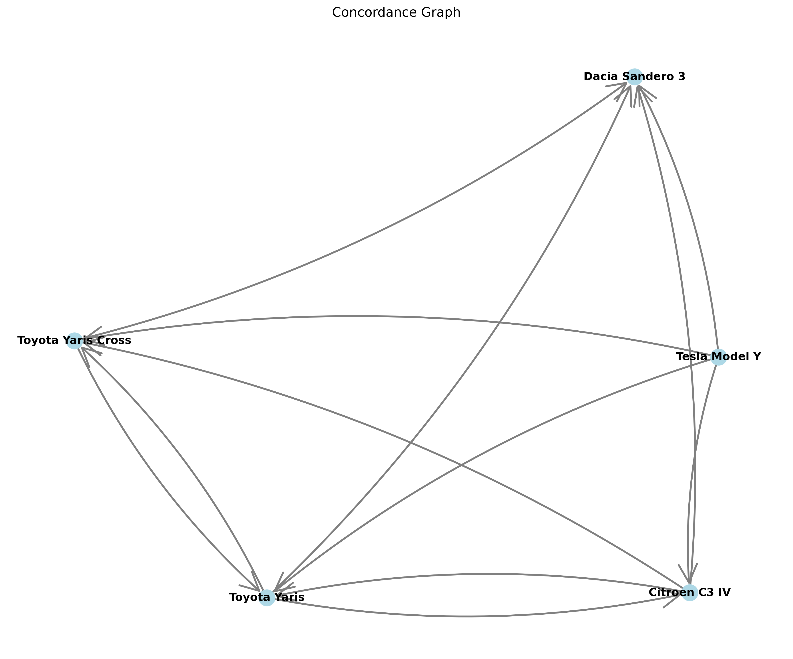
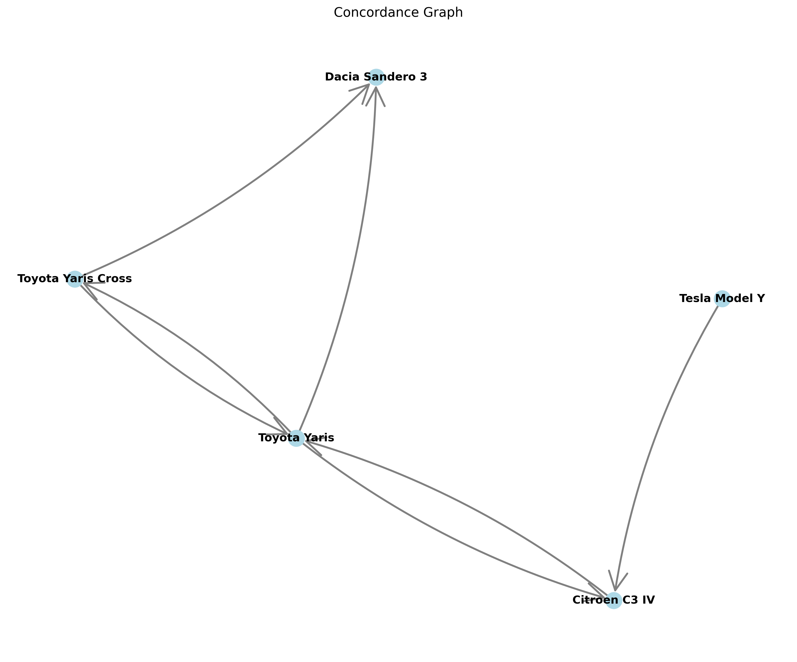
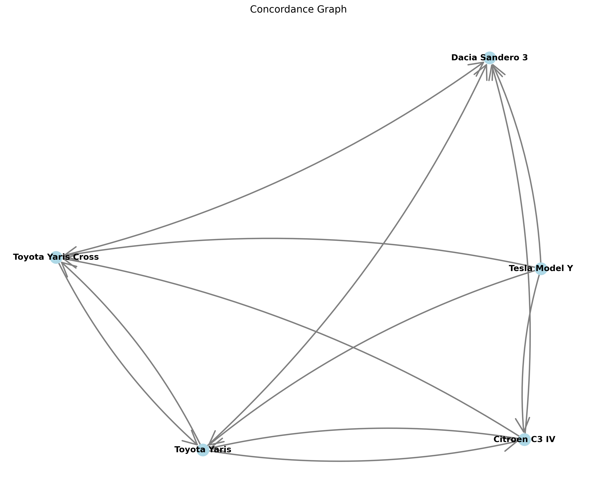

# AMCD Report

## Executive Summary

Cette analyse compare 15 voitures a partir de 11 criteres numeriques repartis en deux familles : `pere_de_famille` pour les exigences de fiabilite, confort, volume, securite, garantie et accessibilite, et `toreto` pour les performances et le plaisir de conduite.

Le workflow Docker a ete lance avec `docker_report_cars.inputs`, la famille de satisfaction/dominance `pere_de_famille` et un seuil ELECTRE de `0.8`. Le filtre de satisfaction n'a elimine aucune alternative dans `satisfaction.csv`. La dominance, appliquee ensuite sur la famille `pere_de_famille`, a retenu 5 alternatives non dominees : Dacia Sandero 3, Citroen C3 IV, Toyota Yaris, Toyota Yaris Cross et Tesla Model Y.

Les scores ponderes designent Tesla Model Y comme meilleure alternative dans tous les scenarios et toutes les methodes de normalisation. ELECTRE nuance ce resultat : Tesla Model Y est le noeud le plus fort dans les scenarios `equal_weights` et `toreto_higher_weight`, mais le scenario `pere_de_famille_higher_weight` fragmente davantage le graphe et met Toyota Yaris, Toyota Yaris Cross et Tesla Model Y dans une position plus comparable. La conclusion robuste est donc : Tesla Model Y domine les agregations globales, mais le choix familial prudent se lit comme un arbitrage entre Tesla Model Y, Toyota Yaris et Toyota Yaris Cross selon le poids accorde au cout et aux criteres familiaux.

## Study Purpose

L'etude cherche a aider au choix d'une voiture parmi des modeles generalistes et un modele electrique performant, en confrontant deux visions de la "bonne voiture" :

- une vision `pere_de_famille`, centree sur la fiabilite, le confort, le coffre, la securite, la garantie et le prix d'achat relatif ;
- une vision `toreto`, centree sur la puissance, le couple, l'acceleration, la vitesse maximale et la sportivite.

Les scenarios testent trois arbitrages : poids egaux entre les deux familles, priorite familiale, puis priorite performance. Le but n'est pas seulement de trouver le meilleur score moyen, mais de voir quelles alternatives restent fortes quand la definition de la bonne voiture change.

## Input Data

| Element | Valeur |
| --- | --- |
| Configuration | `docker_report_cars.inputs` |
| Fichier criteres | `exemples/cars/criteria.json` |
| Fichier alternatives | `exemples/cars/alternatives.csv` |
| Fichier scenarios | `exemples/cars/scenarios.json` |
| Dossier de sortie | `docker-report/` |
| Famille satisfaction/dominance | `pere_de_famille` |
| Seuil ELECTRE | `0.8` |
| Alternatives initiales | 15 |
| Criteres | 11 |
| Familles | `pere_de_famille` : 6 criteres ; `toreto` : 5 criteres |

Les 15 alternatives initiales sont : Renault Clio V, Peugeot 208 II, Dacia Sandero 3, Peugeot 2008 II, Citroen C3 IV, Peugeot 3008 III, Renault 5 E-Tech, Renault Captur II, Dacia Duster 3, Toyota Yaris, Toyota Yaris Cross, Renault Symbioz, Peugeot 308 III, Volkswagen Polo VI et Tesla Model Y.

## Criteria and Scenarios

| Critere | Famille | Direction | Poids | Minimum | Seuil |
| --- | --- | --- | --- | --- | --- |
| Reliability Score (/100) | pere_de_famille | max | 1 | 70 | 5 |
| Luxury/Comfort Score (/10) | pere_de_famille | max | 1 | 6 | 1 |
| Boot Volume (L) | pere_de_famille | max | 1 | 300 | 50 |
| Safety Rating (Euro NCAP stars) | pere_de_famille | max | 1 | 4 | 1 |
| Warranty Length (years) | pere_de_famille | max | 1 | 2 | 1 |
| Affordability Score (/100) | pere_de_famille | max | 1 | 55 | 5 |
| Power (hp) | toreto | max | 1 | 120 | 20 |
| Torque (Nm) | toreto | max | 1 | 180 | 30 |
| 0-100 km/h (s) | toreto | min | 1 | 10 | 0.5 |
| Top Speed (km/h) | toreto | max | 1 | 170 | 10 |
| Sportiness Score (/10) | toreto | max | 1 | 6 | 1 |

| Scenario | Description | Poids `pere_de_famille` | Poids `toreto` |
| --- | --- | ---: | ---: |
| equal_weights | Poids egaux entre les familles | 0.5 | 0.5 |
| pere_de_famille_higher_weight | Priorite aux criteres familiaux | 0.7 | 0.3 |
| toreto_higher_weight | Priorite aux criteres de performance | 0.3 | 0.7 |

## Methodology

Le workflow suit cinq etapes.

La satisfaction verifie les exigences minimales de la famille demandee. Dans cette execution, la famille demandee est `pere_de_famille`. Ces minimums representent des conditions de viabilite : une voiture peut etre attractive sur un score global, mais ne pas etre pertinente si elle echoue sur une exigence consideree essentielle, par exemple la securite, le coffre ou l'accessibilite.

La dominance compare ensuite les alternatives retenues deux a deux, toujours sur la famille `pere_de_famille`. Une alternative est retiree si une autre est au moins aussi bonne, a l'interieur des seuils d'indifference, et meilleure sur les criteres suffisants selon l'implementation.

La normalisation rend les criteres comparables. Le workflow produit quatre normalisations pour les scores ponderes : maximum, max-min, somme et vectorielle. Il produit aussi des fichiers normalises specifiques a ELECTRE.

Le score pondere agrege les criteres selon les poids de scenario. Les poids de famille sont redistribues entre les criteres de chaque famille.

ELECTRE compare les alternatives par paires. Une valeur de concordance proche de 1 signifie que l'alternative en ligne dispose d'un soutien fort pour surclasser l'alternative en colonne. Les graphes ne dessinent que les relations dont la concordance est strictement superieure au seuil `0.8`.

## Satisfaction Analysis

`satisfaction.csv` indique 15 alternatives retenues et aucune alternative eliminee. Le filtre de satisfaction n'a donc pas reduit l'ensemble initial.

| Statut | Alternatives |
| --- | --- |
| Retenues | Renault Clio V, Peugeot 208 II, Peugeot 2008 II, Citroen C3 IV, Renault 5 E-Tech, Renault Captur II, Toyota Yaris Cross, Renault Symbioz, Peugeot 308 III, Volkswagen Polo VI, Peugeot 3008 III, Dacia Duster 3, Toyota Yaris, Tesla Model Y, Dacia Sandero 3 |
| Eliminees | Aucune dans `satisfaction.csv` |

Interpretation : l'etape n'a pas joue ici comme une barriere stricte "tous les minimums doivent etre satisfaits". Plusieurs alternatives conservees echouent pourtant a au moins un minimum familial dans les donnees d'entree : Dacia Sandero 3 est sous le minimum de confort et de securite, Dacia Duster 3 est sous le minimum de securite, Toyota Yaris est sous le minimum de volume de coffre, Peugeot 3008 III et Tesla Model Y sont sous le minimum d'accessibilite. La sortie Docker reste l'autorite du workflow : aucune alternative n'a ete eliminee a cette etape, mais ce point doit etre garde en tete lors de l'interpretation.

Cette absence d'elimination a une consequence importante : la dominance analyse les 15 voitures initiales, pas seulement celles qui satisfont tous les minimums familiaux. Les minimums restent donc utiles pour comprendre les tensions de decision, mais ils n'ont pas bloque formellement les alternatives dans cet artefact.

## Dominance Analysis

`dominance.csv` retient 5 alternatives non dominees apres les comparaisons sur la famille `pere_de_famille`.

| Alternative non dominee | Lecture decisionnelle |
| --- | --- |
| Dacia Sandero 3 | Tres forte accessibilite et garantie de 3 ans, mais faiblesse visible en confort et securite dans les donnees d'entree. |
| Citroen C3 IV | Profil economique equilibre : accessibilite elevee, confort acceptable et securite au minimum familial. |
| Toyota Yaris | Tres forte fiabilite et securite, mais coffre sous le minimum familial. |
| Toyota Yaris Cross | Meme force de fiabilite/securite que Toyota Yaris, avec un coffre plus favorable mais une accessibilite plus faible. |
| Tesla Model Y | Tres fort coffre, confort, garantie, securite et performance, mais accessibilite tres faible. |

Les 10 autres alternatives sont dominees dans le log Docker : Renault Clio V, Peugeot 208 II, Peugeot 2008 II, Peugeot 3008 III, Renault 5 E-Tech, Renault Captur II, Dacia Duster 3, Renault Symbioz, Peugeot 308 III et Volkswagen Polo VI.

La dominance joue donc le role de reduction du probleme. Elle retire des alternatives qui n'apportent pas de compromis distinctif face a une autre voiture sur les criteres familiaux. Exemple : Peugeot 208 II, Renault 5 E-Tech, Renault Captur II et Peugeot 308 III sont dominees par Renault Clio V dans le log. Renault Clio V et Volkswagen Polo VI se dominent mutuellement dans le log car leurs ecarts sont classes comme indifferents sur les criteres familiaux, ce qui montre que les seuils d'indifference influencent fortement cette etape.

## Normalisation Outputs

Les fichiers de normalisation portent uniquement sur les 5 alternatives non dominees. Les fichiers `normalised_max.csv`, `normalised_max_min.csv`, `normalised_sum.csv` et `normalised_vector.csv` alimentent les scores ponderes. Les fichiers `normalised_electre_*.csv` alimentent les matrices et graphes ELECTRE.

| Fichier | Usage | Interpretation |
| --- | --- | --- |
| `normalised/normalised_max.csv` | Scores ponderes | Chaque valeur est rapportee au maximum observe du critere ; les leaders par critere recoivent 100. |
| `normalised/normalised_max_min.csv` | Scores ponderes | Les valeurs sont ramenees entre le minimum et le maximum observes ; cette methode accentue les ecarts. |
| `normalised/normalised_sum.csv` | Scores ponderes | Chaque valeur devient une part du total du critere ; elle mesure la contribution relative au groupe. |
| `normalised/normalised_vector.csv` | Scores ponderes | Les valeurs sont rapportees a une norme vectorielle ; elle limite certains effets d'echelle. |
| `normalised/normalised_electre_equal_weights.csv` | ELECTRE | Donnees preparees pour les concordances du scenario `equal_weights`. |
| `normalised/normalised_electre_pere_de_famille_higher_weight.csv` | ELECTRE | Donnees preparees pour le scenario familial. |
| `normalised/normalised_electre_toreto_higher_weight.csv` | ELECTRE | Donnees preparees pour le scenario performance. |

Les normalisations racontent la meme histoire generale : Tesla Model Y est leader sur le coffre, le confort, la garantie, la puissance, le couple, l'acceleration, la vitesse maximale et la sportivite. Toyota Yaris et Toyota Yaris Cross dominent la fiabilite, et partagent la meilleure securite avec Tesla Model Y. Dacia Sandero 3 domine l'accessibilite. Ces specialisations expliquent ensuite pourquoi Tesla Model Y gagne les scores globaux tout en restant discutable si l'accessibilite est une contrainte forte.

Point notable : avec `normalised_max`, le critere `0-100 km/h (s)` ne donne pas 100 a Tesla Model Y mais 49.14, car la formule min utilise le maximum observe comme reference. Avec `normalised_max_min`, Tesla Model Y recoit bien 100 sur ce critere. C'est une bonne illustration de sensibilite a la normalisation.

## Weighted Score Analysis

Les scores ponderes classent les 5 alternatives non dominees pour chaque scenario et chaque methode de normalisation.

| Scenario | Methode | 1er | 2e | 3e |
| --- | --- | --- | --- | --- |
| equal_weights | normalised_max | Tesla Model Y 88.27 | Toyota Yaris 63.70 | Toyota Yaris Cross 62.22 |
| equal_weights | normalised_max_min | Tesla Model Y 83.33 | Toyota Yaris 38.44 | Toyota Yaris Cross 34.44 |
| equal_weights | normalised_sum | Tesla Model Y 33.66 | Toyota Yaris 24.80 | Toyota Yaris Cross 24.56 |
| equal_weights | normalised_vector | Tesla Model Y 59.78 | Toyota Yaris 41.72 | Toyota Yaris Cross 41.14 |
| pere_de_famille_higher_weight | normalised_max | Tesla Model Y 87.65 | Toyota Yaris 69.71 | Toyota Yaris Cross 69.16 |
| pere_de_famille_higher_weight | normalised_max_min | Tesla Model Y 76.67 | Toyota Yaris 46.91 | Toyota Yaris Cross 45.16 |
| pere_de_famille_higher_weight | normalised_sum | Tesla Model Y 29.65 | Toyota Yaris Cross 22.93 | Toyota Yaris 22.87 |
| pere_de_famille_higher_weight | normalised_vector | Tesla Model Y 56.11 | Toyota Yaris Cross 42.41 | Toyota Yaris 42.38 |
| toreto_higher_weight | normalised_max | Tesla Model Y 88.89 | Toyota Yaris 57.68 | Toyota Yaris Cross 55.28 |
| toreto_higher_weight | normalised_max_min | Tesla Model Y 90.00 | Toyota Yaris 29.97 | Toyota Yaris Cross 23.71 |
| toreto_higher_weight | normalised_sum | Tesla Model Y 37.67 | Toyota Yaris 26.72 | Toyota Yaris Cross 26.20 |
| toreto_higher_weight | normalised_vector | Tesla Model Y 63.45 | Toyota Yaris 41.05 | Toyota Yaris Cross 39.86 |

Tesla Model Y est premier partout. Sa victoire est la plus nette quand la performance compte davantage (`toreto_higher_weight`) : il beneficie de la puissance, du couple, de l'acceleration, de la vitesse et de la sportivite. Il reste premier dans le scenario familial car son coffre, son confort, sa securite et sa garantie compensent son mauvais score d'accessibilite.

Toyota Yaris et Toyota Yaris Cross forment le deuxieme groupe. Toyota Yaris est plus souvent deuxieme, mais Toyota Yaris Cross passe devant sur deux methodes du scenario familial (`normalised_sum` et `normalised_vector`). Cela traduit un compromis familial plus volumineux, sans perdre la force Toyota sur la fiabilite et la securite.

Citroen C3 IV et Dacia Sandero 3 ferment les classements ponderes, mais pas pour les memes raisons. Citroen C3 IV est regulierement devant Dacia Sandero 3 grace a un profil plus equilibre. Dacia Sandero 3 reste interessante par l'accessibilite, mais ses faiblesses en securite, confort et performance pesent lourd dans les aggregations.

## ELECTRE Outranking Analysis

ELECTRE ne calcule pas un score unique ; il indique si une alternative surclasse une autre avec un soutien suffisant. Dans les heatmaps, la ligne est l'alternative A et la colonne l'alternative B. Plus la valeur est proche de 1, plus A a d'arguments pour surclasser B. Dans les graphes, une fleche A -> B apparait quand la concordance de A vers B est strictement superieure a `0.8`.

### Scenario `equal_weights`

La heatmap montre 12 relations au-dessus du seuil. Tesla Model Y surclasse les quatre autres alternatives : Dacia Sandero 3, Citroen C3 IV, Toyota Yaris et Toyota Yaris Cross. Il ne recoit aucune fleche entrante, ce qui le place clairement en position dominante dans ce scenario.

Toyota Yaris est aussi forte : elle surclasse Dacia Sandero 3, Citroen C3 IV et Toyota Yaris Cross. Cependant elle est aussi surclassee par Citroen C3 IV, Toyota Yaris Cross et Tesla Model Y. Ce double sens avec Citroen C3 IV et Toyota Yaris Cross montre qu'ELECTRE revele des comparaisons partiellement contradictoires : selon les criteres, les arguments peuvent soutenir les deux directions.

Dacia Sandero 3 ne surclasse personne au seuil 0.8 et recoit quatre fleches entrantes. Son profil d'accessibilite ne suffit donc pas a compenser ses faiblesses quand les deux familles ont le meme poids.

### Scenario `pere_de_famille_higher_weight`

Le scenario familial est le plus discriminant : le graphe descend a 7 relations. Plusieurs valeurs restent juste sous le seuil, par exemple Tesla Model Y vers Dacia Sandero 3, Toyota Yaris et Toyota Yaris Cross a 0.77, et Toyota Yaris Cross vers Tesla Model Y a 0.58. Visuellement, le graphe est donc moins dense.

Toyota Yaris surclasse Dacia Sandero 3, Citroen C3 IV et Toyota Yaris Cross. Toyota Yaris Cross surclasse Dacia Sandero 3 et Toyota Yaris. Tesla Model Y ne conserve qu'une relation de surclassement vers Citroen C3 IV. Il reste sans fleche entrante, mais il n'ecrase plus le reseau : l'augmentation du poids familial reduit l'avantage apporte par ses performances et rend son accessibilite plus penalisante.

Ce scenario est celui qui merite la lecture la plus prudente. Les scores ponderes donnent encore Tesla Model Y gagnante, mais ELECTRE montre une preference moins totale : Toyota Yaris et Toyota Yaris Cross deviennent des alternatives familialement tres defensables.

### Scenario `toreto_higher_weight`

Le scenario performance retrouve 12 relations, comme `equal_weights`, mais avec des concordances plus fortes pour Tesla Model Y. Tesla Model Y surclasse les quatre autres alternatives avec des valeurs de 0.90 a 0.95 et ne recoit aucune fleche entrante. C'est le scenario ou son profil est le plus convaincant.

Toyota Yaris reste solide contre Dacia Sandero 3, Citroen C3 IV et Toyota Yaris Cross, mais elle est surclassee par Tesla Model Y et entretient des relations reciproques avec Citroen C3 IV et Toyota Yaris Cross. Dacia Sandero 3 est encore le noeud le plus faible : aucune fleche sortante et quatre fleches entrantes.

Dans cette lecture, le graphe confirme les scores ponderes : si la performance compte fortement, Tesla Model Y est l'alternative la plus robuste.

## Scenario Sensitivity

| Alternative | Scores ponderes | ELECTRE equal_weights | ELECTRE familial | ELECTRE performance |
| --- | --- | --- | --- | --- |
| Tesla Model Y | 1er partout | 4 sorties, 0 entree | 1 sortie, 0 entree | 4 sorties, 0 entree |
| Toyota Yaris | 2e le plus souvent | 3 sorties, 3 entrees | 3 sorties, 2 entrees | 3 sorties, 3 entrees |
| Toyota Yaris Cross | 2e dans deux methodes familiales | 2 sorties, 3 entrees | 2 sorties, 1 entree | 2 sorties, 3 entrees |
| Citroen C3 IV | Milieu/bas de classement | 3 sorties, 2 entrees | 1 sortie, 2 entrees | 3 sorties, 2 entrees |
| Dacia Sandero 3 | Derniere dans les scores ponderes | 0 sortie, 4 entrees | 0 sortie, 2 entrees | 0 sortie, 4 entrees |

La sensibilite principale concerne l'ecart entre score pondere et ELECTRE dans le scenario familial. Les scores ponderes gardent Tesla Model Y loin devant parce que ses forces numeriques sont tres fortes. ELECTRE, avec un seuil de 0.8, exige un soutien pair-a-pair plus net : dans le scenario familial, Tesla Model Y ne depasse plus le seuil contre Dacia Sandero 3, Toyota Yaris et Toyota Yaris Cross.

Toyota Yaris est l'alternative la plus stable derriere Tesla Model Y. Elle est deuxieme dans la majorite des classements ponderes et reste tres active dans les graphes ELECTRE. Toyota Yaris Cross est proche, surtout quand les criteres familiaux augmentent. Citroen C3 IV est un compromis economique, mais moins decisif. Dacia Sandero 3 depend presque entierement de son avantage d'accessibilite et ne ressort pas dans ELECTRE.

## Final Interpretation

Si l'on accepte l'agregation par score pondere comme critere principal, Tesla Model Y est la recommandation la plus forte : elle gagne tous les scenarios et toutes les normalisations, avec des marges importantes. Ce resultat vient de sa domination sur beaucoup de criteres de capacite, confort, garantie et performance.

Si la decision doit etre strictement orientee "pere de famille", il faut lire le resultat avec plus de nuance. Tesla Model Y reste excellente sur le coffre, la securite, le confort et la garantie, mais son faible score d'accessibilite empeche ELECTRE de produire un surclassement large au seuil 0.8. Dans cette lecture, Toyota Yaris et Toyota Yaris Cross sont les alternatives concurrentes les plus credibles : Toyota Yaris pour la fiabilite et la securite, Toyota Yaris Cross pour un compromis plus familial avec davantage de coffre.

La Dacia Sandero 3 n'est pas une gagnante globale malgre son accessibilite. Elle est non dominee car elle apporte un compromis distinctif, mais ses faiblesses en confort, securite et performance la placent en bas des scores ponderes et sans relation sortante ELECTRE. Citroen C3 IV est plus equilibree, mais elle ne depasse pas les Toyota ni Tesla Model Y dans les conclusions globales.

Conclusion decisionnelle : Tesla Model Y est le vainqueur mathematique robuste. Pour un choix familial sensible au cout, Toyota Yaris et Toyota Yaris Cross doivent rester dans la discussion finale, car ELECTRE montre que la preference pour Tesla Model Y devient moins nette lorsque la famille `pere_de_famille` recoit 70 % du poids.

## Limitations and Assumptions

Les resultats dependent entierement des donnees configurees dans `criteria.json`, `alternatives.csv` et `scenarios.json`. Aucune information externe sur les voitures n'a ete ajoutee.

La satisfaction et la dominance ont ete lancees uniquement avec la famille `pere_de_famille`. Les criteres `toreto` n'interviennent donc pas dans la reduction initiale des alternatives ; ils interviennent ensuite dans la normalisation, les scores ponderes et ELECTRE.

`satisfaction.csv` n'elimine aucune alternative, meme si plusieurs voitures sont sous certains minimums familiaux dans les donnees d'entree. L'artefact doit donc etre interprete comme la sortie effective du script, pas comme une validation stricte de tous les bare minimums.

La dominance utilise des seuils d'indifference. Le log montre des cas de dominance mutuelle ou de quasi-egalite, ce qui signale que les alternatives proches peuvent etre traitees de maniere tres sensible aux seuils.

Les conclusions ELECTRE dependent fortement du seuil `0.8`. Avec un seuil plus bas, les graphes seraient plus denses ; avec un seuil plus haut, certaines relations reciproques disparaitraient.

Les normalisations ne produisent pas toutes la meme intensite d'ecart. `normalised_max_min` accentue fortement les differences, tandis que `normalised_sum` produit des valeurs plus compactes. La stabilite de Tesla Model Y est donc importante, mais les rangs secondaires doivent etre lus avec prudence.

## Artifact Index

| Artefact | Description |
| --- | --- |
| [README.md](README.md) | Resume Docker des parametres et fichiers generes. |
| [docker_report.log](docker_report.log) | Log complet de l'execution Docker. |
| [satisfaction.csv](satisfaction.csv) | Alternatives retenues et eliminees par satisfaction. |
| [dominance.csv](dominance.csv) | Alternatives non dominees utilisees pour les etapes suivantes. |
| [weights_results.csv](weights_results.csv) | Scores ponderes par scenario et methode de normalisation. |
| [normalised/normalised_max.csv](normalised/normalised_max.csv) | Donnees normalisees par maximum. |
| [normalised/normalised_max_min.csv](normalised/normalised_max_min.csv) | Donnees normalisees par max-min. |
| [normalised/normalised_sum.csv](normalised/normalised_sum.csv) | Donnees normalisees par somme. |
| [normalised/normalised_vector.csv](normalised/normalised_vector.csv) | Donnees normalisees par norme vectorielle. |
| [normalised/normalised_electre_equal_weights.csv](normalised/normalised_electre_equal_weights.csv) | Donnees normalisees pour ELECTRE, scenario `equal_weights`. |
| [normalised/normalised_electre_pere_de_famille_higher_weight.csv](normalised/normalised_electre_pere_de_famille_higher_weight.csv) | Donnees normalisees pour ELECTRE, scenario familial. |
| [normalised/normalised_electre_toreto_higher_weight.csv](normalised/normalised_electre_toreto_higher_weight.csv) | Donnees normalisees pour ELECTRE, scenario performance. |
| [electra/electra_results.txt](electra/electra_results.txt) | Matrices de concordance ELECTRE. |
| [electra/heatmap_equal_weights.png](electra/heatmap_equal_weights.png) | Heatmap de concordance du scenario `equal_weights`. |
| [electra/outranking_graph_equal_weights.png](electra/outranking_graph_equal_weights.png) | Graphe de surclassement du scenario `equal_weights`. |
| [electra/heatmap_pere_de_famille_higher_weight.png](electra/heatmap_pere_de_famille_higher_weight.png) | Heatmap de concordance du scenario familial. |
| [electra/outranking_graph_pere_de_famille_higher_weight.png](electra/outranking_graph_pere_de_famille_higher_weight.png) | Graphe de surclassement du scenario familial. |
| [electra/heatmap_toreto_higher_weight.png](electra/heatmap_toreto_higher_weight.png) | Heatmap de concordance du scenario performance. |
| [electra/outranking_graph_toreto_higher_weight.png](electra/outranking_graph_toreto_higher_weight.png) | Graphe de surclassement du scenario performance. |
