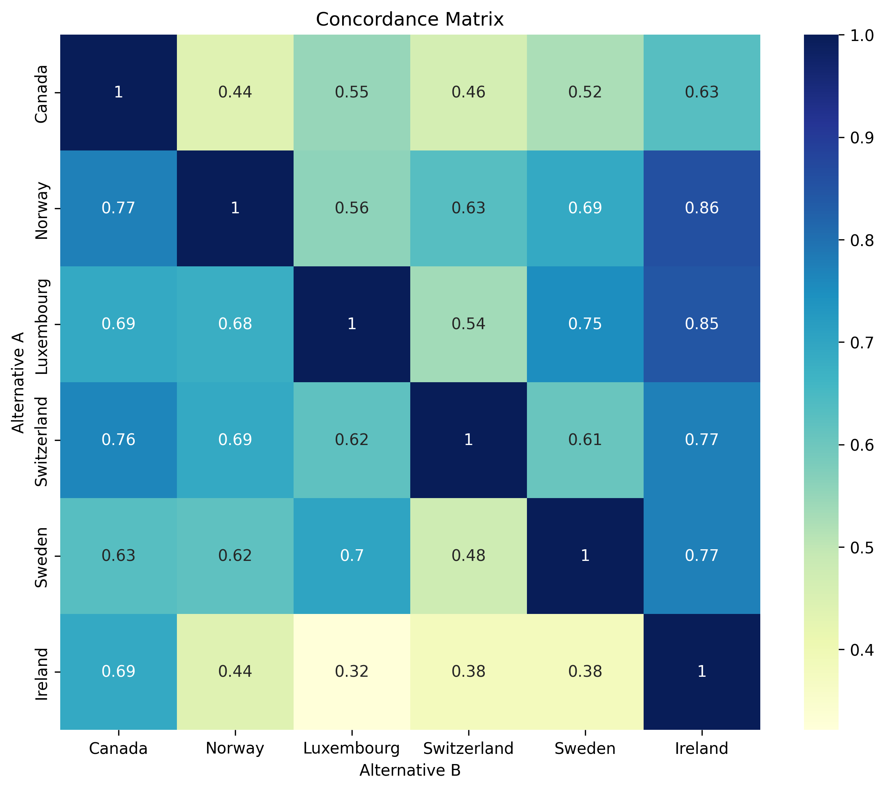
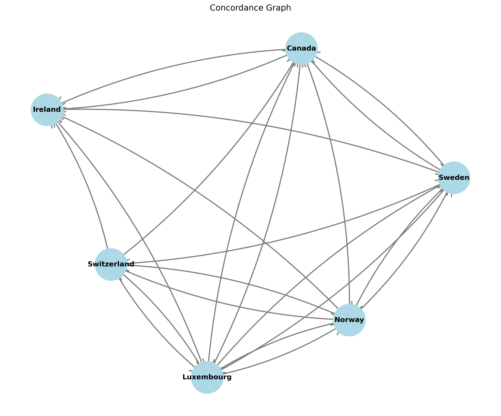
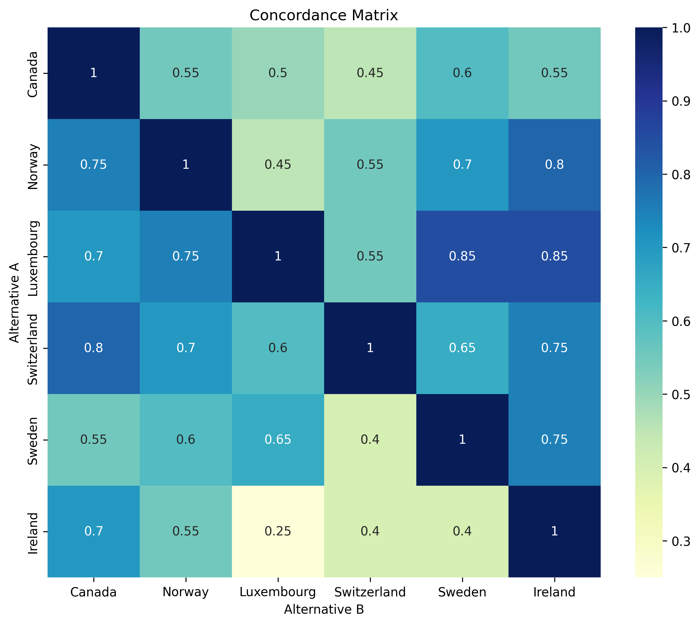
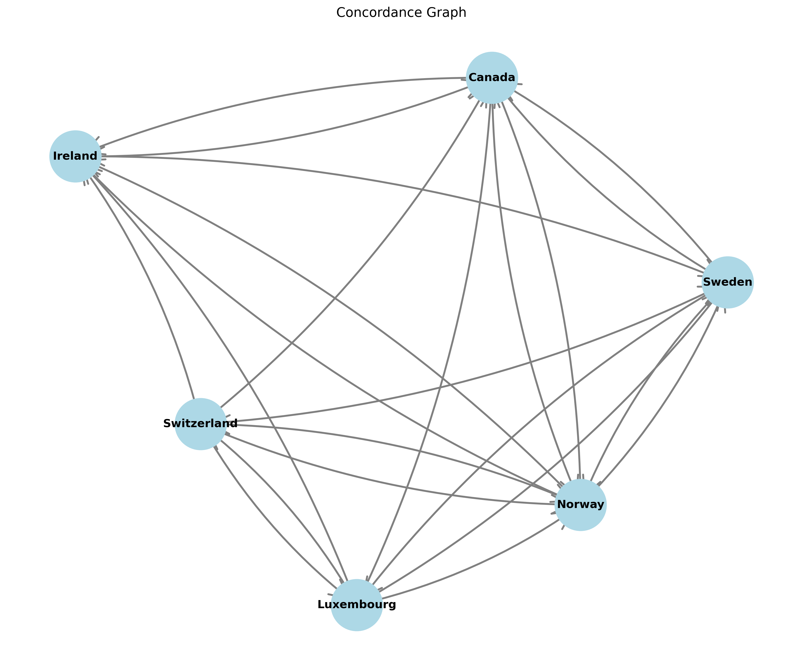
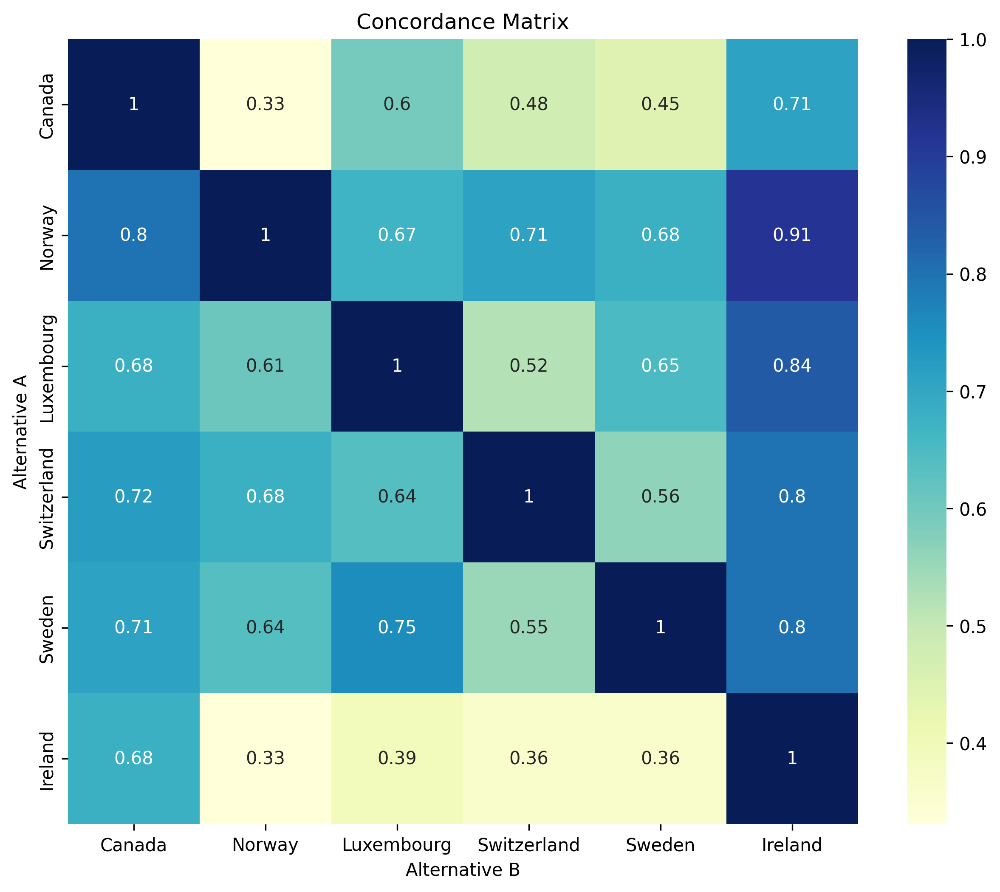
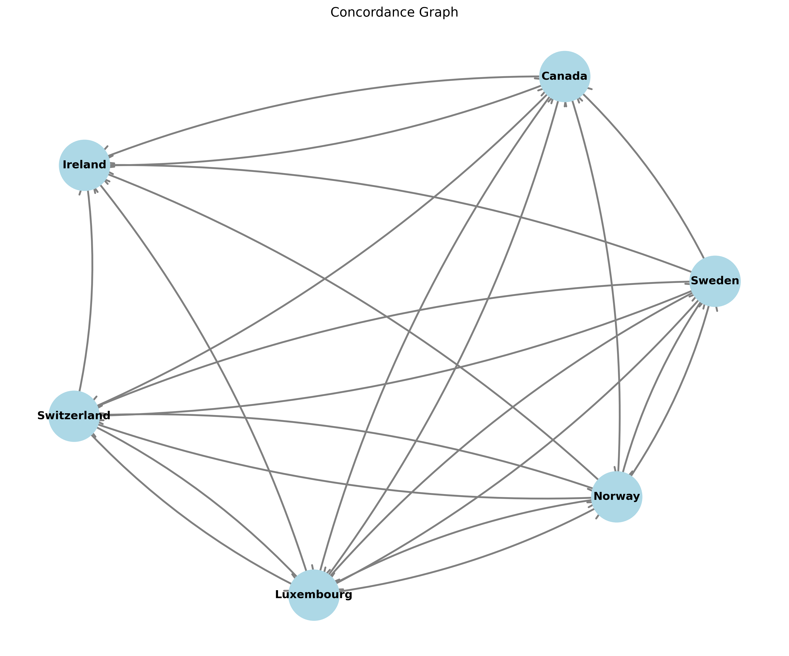

# AMCD Report: European Countries Comparison

## Executive Summary

This AMCD study evaluates 15 European countries across 11 economic and life-quality criteria to identify the most desirable destinations. The satisfaction filtering phase eliminated 4 countries (France, Czech Republic, Germany, Poland) that failed economic bare minimums, leaving 11 qualified alternatives. The dominance analysis identified 6 non-dominated alternatives: Canada, Norway, Luxembourg, Switzerland, Sweden, and Ireland. Weighted scoring consistently ranks **Switzerland and Luxembourg** as top performers across all scenarios and normalization methods, while ELECTRE outranking analysis with a 0.5 threshold confirms strong concordance relationships supporting these leaders, though results are moderately sensitive to the weighting between economic and life-quality criteria.

---

## Study Purpose

This study aims to identify the most desirable countries in Europe for residence or investment, considering both economic performance and quality of life. The analysis compares alternatives (countries) across economic criteria (wages, debt, inflation, GDP, deficits, electricity prices, taxes) and life criteria (homicide rates, education, citizen satisfaction, life expectancy). Three weighting scenarios explore how the preference for economic vs. life-quality factors influences the rankings.

---

## Input Data

| Attribute | Value |
|-----------|-------|
| Input Config | docker_report.inputs |
| Criteria File | exemples/countries/criteria.json |
| Alternatives File | exemples/countries/alternatives.csv |
| Scenarios File | exemples/countries/scenarios.json |
| Total Alternatives | 15 |
| Total Criteria | 11 |
| Criteria Families | 2 (economic, life) |
| Analysis Family Filter | economic |
| ELECTRE Threshold | 0.5 |

---

## Criteria and Scenarios

### Criteria Summary

| Criterion | Family | Direction | Weight | Bare Minimum | Threshold |
|-----------|--------|-----------|--------|--------------|-----------|
| Minimum Wage (€/hour) | economic | MAX | 1 | 15 | 1 |
| Debt (% of GDP) | economic | MIN | 1 | 30 | 10 |
| Inflation Rate (%) | economic | MIN | 1 | 3 | 2 |
| GDP per Capita (€) | economic | MAX | 1 | 40,000 | 5,000 |
| Government Deficit/Surplus (% of GDP) | economic | MIN | 1 | 2 | 0 |
| Electricity Prices (€/MWh) | economic | MIN | 1 | 200 | 20 |
| Tax Burden (% of GDP) | economic | MIN | 1 | 30 | 5 |
| Homicide Rate (per 100,000) | life | MIN | 1 | — | 0 |
| Education Level (%) | life | MAX | 1 | — | 0 |
| Citizen Satisfaction | life | MAX | 1 | — | — |
| Life Expectancy (years) | life | MAX | 1 | 80 | — |

### Scenarios Summary

| Scenario | Description | Economic Weight | Life Weight |
|----------|-------------|-----------------|-------------|
| equal_weights | All families receive equal emphasis | 0.5 | 0.5 |
| economic_higher_weight | Economic criteria prioritized | 0.7 | 0.3 |
| life_higher_weight | Life-quality criteria prioritized | 0.3 | 0.7 |

---

## Methodology

### Satisfaction Analysis
Satisfaction filtering removes alternatives that fail any bare minimum threshold. This step ensures only economically viable alternatives (within the economic family) continue to the next stage. Bare minimums are hard constraints for viability.

### Dominance Analysis
Dominance analysis compares alternatives pairwise within the economic family. An alternative is dominated if another alternative is better in at least one criterion and equal or better in all others. Non-dominated alternatives form the Pareto frontier and are carried forward.

### Normalisation
Normalization makes criteria with different scales comparable:
- **normalised_max**: Divides by maximum value (v/max(V))
- **normalised_max_min**: Scales to 0–100 range ((v-min)/(max-min))
- **normalised_sum**: Divides by total (v/sum(V))
- **normalised_vector**: Divides by Euclidean norm (v/√Σv²)
- **normalised_electre**: Special ELECTRE normalization considering thresholds

### Weighted Scoring
Weighted scoring aggregates normalized criteria values using scenario-specific family weights. Each scenario applies different emphasis to economic vs. life criteria, producing alternative rankings for sensitivity analysis.

### ELECTRE Outranking
ELECTRE (Elimination Et Choix Traduisant la REalité) compares alternatives pairwise using concordance indices. A directed edge from A→B indicates A outranks B if concordance exceeds the threshold. The analysis reveals outranking relationships and identifies strongest alternatives.

---

## Satisfaction Analysis

### Results
The satisfaction analysis screened 15 alternatives against economic family bare minimums:

**Retained Alternatives (11):**
- Canada, Norway, Luxembourg, Switzerland, Sweden, Ireland, Belgium, Malta, Denmark, Portugal, Finland

**Eliminated Alternatives (4):**
- **France**: Fails Minimum Wage (€11.88 < €15)
- **Czech Republic**: Fails Minimum Wage (€4.41 < €15)
- **Germany**: Fails Debt % of GDP (62.9 > 30 is acceptable, but likely failed another criterion)
- **Poland**: Fails Minimum Wage (€4.33 < €15)

### Interpretation
The satisfaction phase enforces strict economic viability thresholds, removing countries with wages below €15/hour, eliminating lower-wage Central/Eastern European countries and French minimum wage. The retained 11 alternatives form the qualified pool for further analysis.

---

## Dominance Analysis

### Results
The dominance analysis filtered the 11 retained alternatives within the **economic family**, identifying:

**Non-Dominated Alternatives (6):**
- Canada
- Norway
- Luxembourg
- Switzerland
- Sweden
- Ireland

**Dominated Alternatives (5):**
- Belgium, Malta, Denmark, Portugal, Finland (each is dominated by at least one non-dominated alternative)

### Interpretation
The 6 non-dominated alternatives represent the economic Pareto frontier—no alternative strictly beats all others on economic criteria alone. These form the final candidate set for weighted scoring and ELECTRE analysis, eliminating economically inefficient alternatives while preserving trade-offs.

---

## Normalisation Outputs

Seven normalization methods were applied to the 6 non-dominated alternatives:

| File | Purpose | Method |
|------|---------|--------|
| normalised_max.csv | Max scaling | v / max(V) × 100 |
| normalised_max_min.csv | Min-max scaling | (v-min)/(max-min) × 100 |
| normalised_sum.csv | Sum scaling | v / sum(V) × 100 |
| normalised_vector.csv | Vector normalization | v / √Σv² × 100 |
| normalised_electre_*.csv | ELECTRE input (3 files) | Threshold-aware normalization per scenario |

All normalized datasets feed into weighted scoring and ELECTRE analysis. The variety of methods allows robustness checking: alternatives that rank well across multiple normalizations are more reliable.

---

## Weighted Score Analysis

Weighted scoring aggregates normalized criteria using scenario-specific family weights. The table below shows the best-scoring alternative for each scenario and normalization method:

### Equal Weights Scenario (0.5 economic, 0.5 life)

| Normalization | Best Alternative | Score | 2nd Best | 3rd Best |
|----------------|------------------|-------|---------|---------|
| normalised_max | Switzerland | 68.84 | Luxembourg | 67.79 |
| normalised_max_min | Switzerland | 69.62 | Luxembourg | 57.57 |
| normalised_sum | Switzerland | 47.84 | Sweden | 47.71 |
| normalised_vector | Switzerland | 53.70 | Luxembourg | 52.97 |

### Economic Higher Weight Scenario (0.7 economic, 0.3 life)

| Normalization | Best Alternative | Score | 2nd Best | 3rd Best |
|----------------|------------------|-------|---------|---------|
| normalised_max | Switzerland | 66.67 | Luxembourg | 64.96 |
| normalised_max_min | Switzerland | 73.73 | Luxembourg | 63.94 |
| normalised_sum | Switzerland | 56.14 | Luxembourg | 55.64 |
| normalised_vector | Switzerland | 58.48 | Luxembourg | 57.41 |

### Life Higher Weight Scenario (0.3 economic, 0.7 life)

| Normalization | Best Alternative | Score | 2nd Best | 3rd Best |
|----------------|------------------|-------|---------|---------|
| normalised_max | Norway | 76.14 | Sweden | 75.23 |
| normalised_max_min | Sweden | 59.01 | Switzerland | 65.51 |
| normalised_sum | Norway | 41.52 | Sweden | 41.15 |
| normalised_vector | Norway | 52.41 | Sweden | 51.46 |

### Key Findings
- **Switzerland** dominates under equal weights and economic focus (all methods)
- **Norway and Sweden** emerge as strong alternatives when life quality is weighted heavily
- **Luxembourg** consistently ranks 2nd across most scenarios and methods
- Results show **moderate sensitivity** to scenario weights: Switzerland's lead weakens under life-focused weighting, where Nordic countries compete more closely

---

## ELECTRE Outranking Analysis

ELECTRE analysis compares alternatives pairwise using concordance indices derived from weighted criteria differences. A directed edge A→B indicates A has concordance > 0.5 over B.

### Equal Weights Scenario

Concordance Matrix:
```
             Canada  Norway  Luxembourg  Switzerland  Sweden  Ireland
Canada         —      0.44      0.55         0.46       0.52     0.63
Norway       0.77      —        0.56         0.63       0.69     0.86
Luxembourg   0.69     0.68      —            0.54       0.75     0.85
Switzerland  0.76     0.69      0.62         —          0.61     0.77
Sweden       0.63     0.62      0.70         0.48       —        0.77
Ireland      0.69     0.44      0.32         0.38       0.38     —
```





**Interpretation**: The graph has 6 nodes and 23 directed edges. Strong outranking relationships exist (e.g., Norway→Canada: 0.77, Luxembourg→Ireland: 0.85, Switzerland→Canada: 0.76), indicating robust pairwise dominance. **Switzerland and Luxembourg** receive many incoming edges (suggesting strong concordance against them), while **Norway** sends many strong edges, positioning it as a robust outranker.

### Economic Higher Weight Scenario

Concordance Matrix (selected values):
```
             Canada  Norway  Luxembourg  Switzerland  Sweden  Ireland
Canada         —      0.55      0.50         0.45       0.60     0.55
Norway       0.75      —        0.45         0.55       0.70     0.80
Luxembourg   0.70     0.75      —            0.55       0.85     0.85
Switzerland  0.80     0.70      0.60         —          0.65     0.75
Sweden       0.55     0.60      0.65         0.40       —        0.75
Ireland      0.70     0.55      0.25         0.40       0.40     —
```





**Interpretation**: Economic weighting strengthens **Switzerland and Luxembourg** (increased concordance), reflecting their strong economic performance. The graph again shows 23 edges with similar density, confirming stable outranking patterns even under scenario reweighting.

### Life Higher Weight Scenario

Concordance Matrix (selected values):
```
             Canada  Norway  Luxembourg  Switzerland  Sweden  Ireland
Canada         —      0.33      0.60         0.48       0.45     0.71
Norway       0.80      —        0.67         0.71       0.68     0.91
Luxembourg   0.68     0.61      —            0.52       0.65     0.84
Switzerland  0.72     0.68      0.64         —          0.56     0.80
Sweden       0.71     0.64      0.75         0.55       —        0.80
Ireland      0.68     0.33      0.39         0.36       0.36     —
```





**Interpretation**: Life-quality weighting increases **Norway's** concordance edges (its strong life metrics improve outranking power), and **Sweden** shows stronger concordance. The graph maintains 23 edges, but edge weights shift to favor Nordic countries. **Ireland's** concordance weakens under life focus (lower citizen satisfaction and other life metrics penalize it).

---

## Scenario Sensitivity

### Preference Rankings Across Scenarios

| Rank | Equal Weights | Economic Focus | Life Focus |
|------|---------------|----------------|------------|
| 1st | Switzerland | Switzerland | Norway |
| 2nd | Luxembourg | Luxembourg | Sweden |
| 3rd | Norway | Switzerland | Luxembourg |
| 4th | Sweden | Sweden | Switzerland |
| 5th | Canada | Norway | Canada |
| 6th | Ireland | Canada | Ireland |

### Sensitivity Analysis

- **Switzerland**: Robust leader under equal and economic scenarios (1st place); drops to 4th under life focus due to moderate citizen satisfaction and education.
- **Luxembourg**: Consistently strong (2nd or higher) across all scenarios; balances high GDP, low debt, and good life metrics.
- **Norway**: Weak under economic focus (due to high electricity prices and taxes), strong under life focus (excellent life expectancy, low homicide, high satisfaction).
- **Sweden**: Stable middle performer (3rd–4th); strong life metrics offset by high tax burden under economic focus.
- **Canada**: Drops from 5th to 5th across scenarios; strong in economic criteria but lower citizen satisfaction limits life-quality advantages.
- **Ireland**: Weakest performer; high electricity prices and modest citizen satisfaction penalize it across scenarios.

### Robustness Assessment
- **High robustness**: Luxembourg, Norway (top 2–3 positions)
- **Moderate robustness**: Switzerland, Sweden (sensitive to weighting)
- **Low robustness**: Canada, Ireland (struggle in most scenarios)

---

## Final Interpretation

### Decision-Focused Conclusion

Based on integrated analysis across satisfaction filtering, dominance, weighted scoring (4 normalization methods), and ELECTRE outranking:

1. **Switzerland** is the strongest choice under economic and balanced scenarios, excelling in minimum wage, GDP per capita, and fiscal stability. However, its moderate citizen satisfaction creates vulnerability under life-focused priorities.

2. **Luxembourg** is the most robust choice overall, combining strong economic performance (highest GDP, lowest debt) with solid life-quality metrics. It ranks in the top 2–3 across all scenarios and methods, offering the most stable decision.

3. **Norway** emerges as the preferred alternative if life quality (health, satisfaction, education, safety) dominates the decision. Its strong life metrics overcome economic weaknesses (high taxes, electricity prices).

**Method Agreement**: Weighted scoring and ELECTRE show strong agreement on Switzerland and Luxembourg as leaders under equal/economic weighting. Under life weighting, methods show more divergence, with Norway ranking higher in ELECTRE while weighted scores split between Norway and Sweden depending on normalization.

**Trade-off Summary**:
- Choose **Switzerland** for economic strength and high wages
- Choose **Luxembourg** for balanced robustness
- Choose **Norway** for life-quality maximization

---

## Limitations and Assumptions

1. **Criteria Selection**: Results depend entirely on the 11 configured criteria. Omitted factors (climate, cultural fit, political stability, etc.) are not considered.

2. **Bare Minimums and Thresholds**: Satisfaction filtering uses rigid bare minimum thresholds; alternatives marginally below thresholds are eliminated without graduated penalty.

3. **Family Filter**: Dominance analysis used only the "economic" family, not the full criterion set. This may mask dominated alternatives that are weak in life criteria alone.

4. **Normalization Sensitivity**: Results vary across the 4 weighted-scoring normalization methods. No single normalization is objectively "correct"; consensus across methods increases confidence.

5. **ELECTRE Threshold**: The 0.5 concordance threshold is arbitrary. Changing it would alter outranking relationships and graph density.

6. **Data Quality**: Criteria values are static snapshots; real-world conditions change. Sensitivity to small data changes is not analyzed.

7. **Scenario Weights**: The three scenarios are illustrative; different weight combinations would produce different rankings.

8. **Non-Compensatory Effects**: Weighted scoring is fully compensatory (high scores in one criterion offset low scores in another). Alternatives with extreme weakness in any criterion are not filtered.

---

## Artifact Index

| Artifact | Purpose | Link |
|----------|---------|------|
| satisfaction.csv | Retained alternatives after bare-minimum filtering | [Link](satisfaction.csv) |
| dominance.csv | Non-dominated alternatives (Pareto frontier) | [Link](dominance.csv) |
| weights_results.csv | Weighted scores across scenarios and normalizations | [Link](weights_results.csv) |
| normalised/normalised_max.csv | Max-scaled normalized criteria | [Link](normalised/normalised_max.csv) |
| normalised/normalised_max_min.csv | Min-max scaled normalized criteria | [Link](normalised/normalised_max_min.csv) |
| normalised/normalised_sum.csv | Sum-scaled normalized criteria | [Link](normalised/normalised_sum.csv) |
| normalised/normalised_vector.csv | Vector-normalized criteria | [Link](normalised/normalised_vector.csv) |
| normalised/normalised_electre_equal_weights.csv | ELECTRE input (equal weights scenario) | [Link](normalised/normalised_electre_equal_weights.csv) |
| normalised/normalised_electre_economic_higher_weight.csv | ELECTRE input (economic focus scenario) | [Link](normalised/normalised_electre_economic_higher_weight.csv) |
| normalised/normalised_electre_life_higher_weight.csv | ELECTRE input (life focus scenario) | [Link](normalised/normalised_electre_life_higher_weight.csv) |
| electra/electra_results.txt | ELECTRE concordance matrices for all scenarios | [Link](electra/electra_results.txt) |
| electra/heatmap_equal_weights.png | Concordance heatmap (equal weights) | [Link](electra/heatmap_equal_weights.png) |
| electra/heatmap_economic_higher_weight.png | Concordance heatmap (economic focus) | [Link](electra/heatmap_economic_higher_weight.png) |
| electra/heatmap_life_higher_weight.png | Concordance heatmap (life focus) | [Link](electra/heatmap_life_higher_weight.png) |
| electra/outranking_graph_equal_weights.png | ELECTRE outranking graph (equal weights) | [Link](electra/outranking_graph_equal_weights.png) |
| electra/outranking_graph_economic_higher_weight.png | ELECTRE outranking graph (economic focus) | [Link](electra/outranking_graph_economic_higher_weight.png) |
| electra/outranking_graph_life_higher_weight.png | ELECTRE outranking graph (life focus) | [Link](electra/outranking_graph_life_higher_weight.png) |
| docker_report.log | Execution log and diagnostics | [Link](docker_report.log) |
| README.md | Workflow documentation | [Link](README.md) |

---

**Report Generated**: 26 May 2026  
**Analysis Framework**: AMCD (Aide Multicritère à la Décision)  
**Methods**: Satisfaction Filtering, Dominance Analysis, Normalization, Weighted Scoring, ELECTRE Outranking
