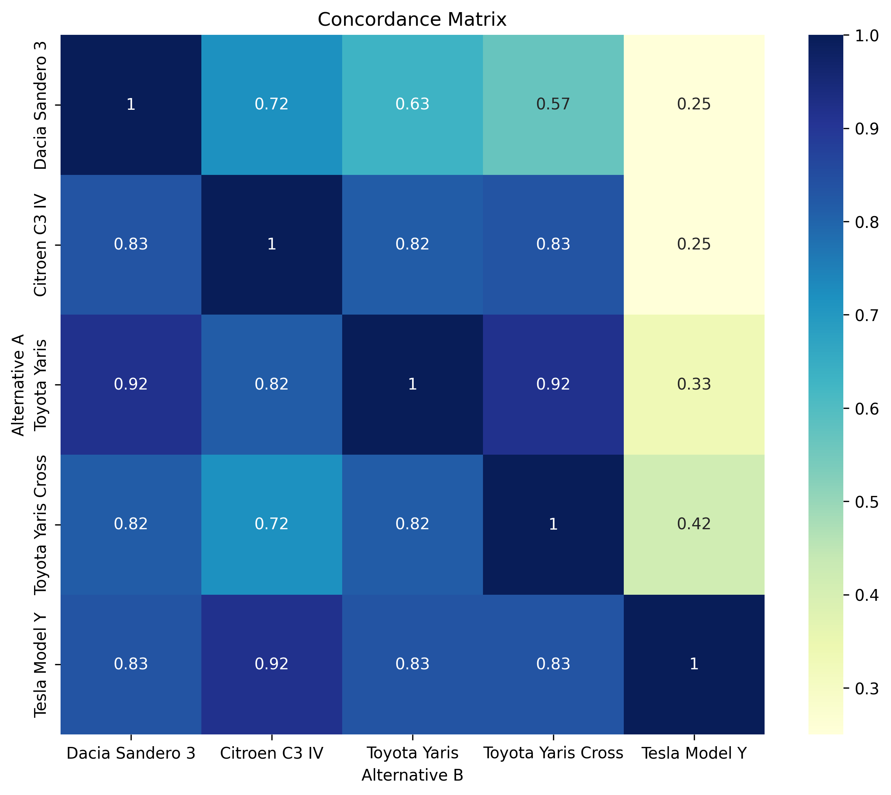
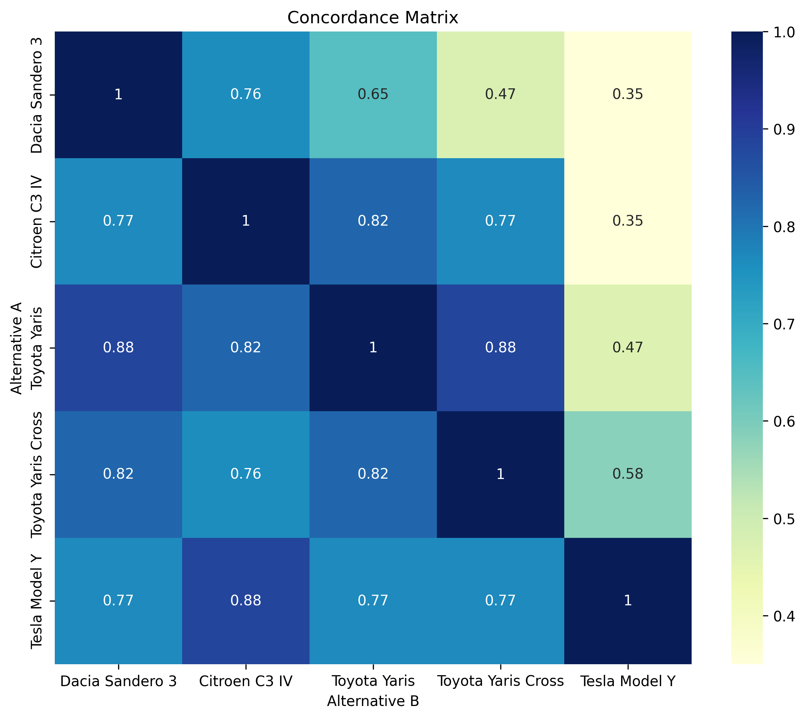
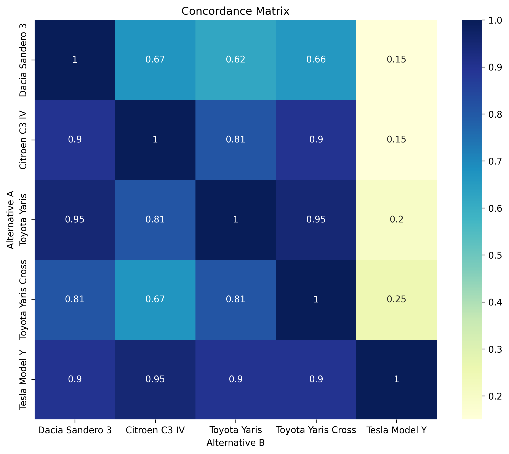
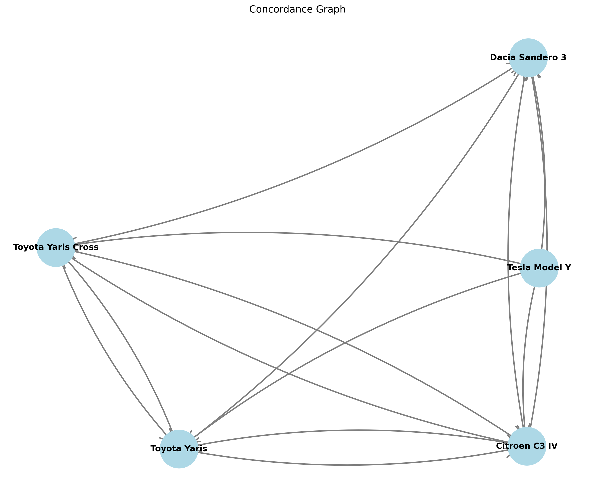
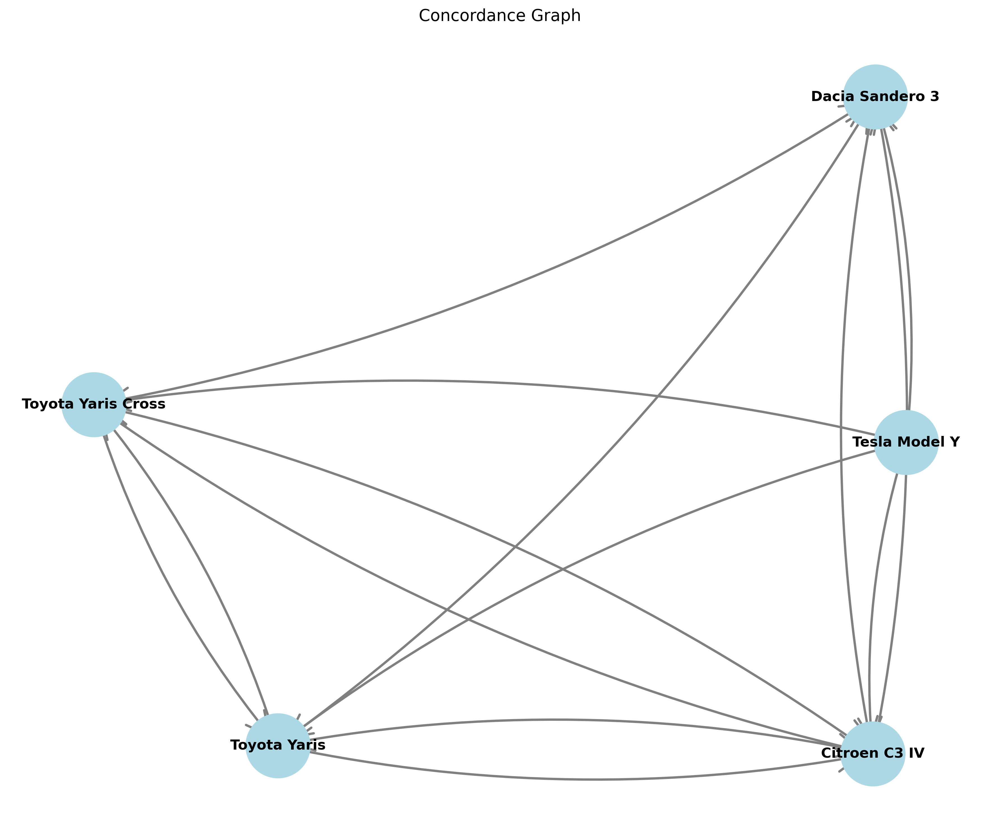
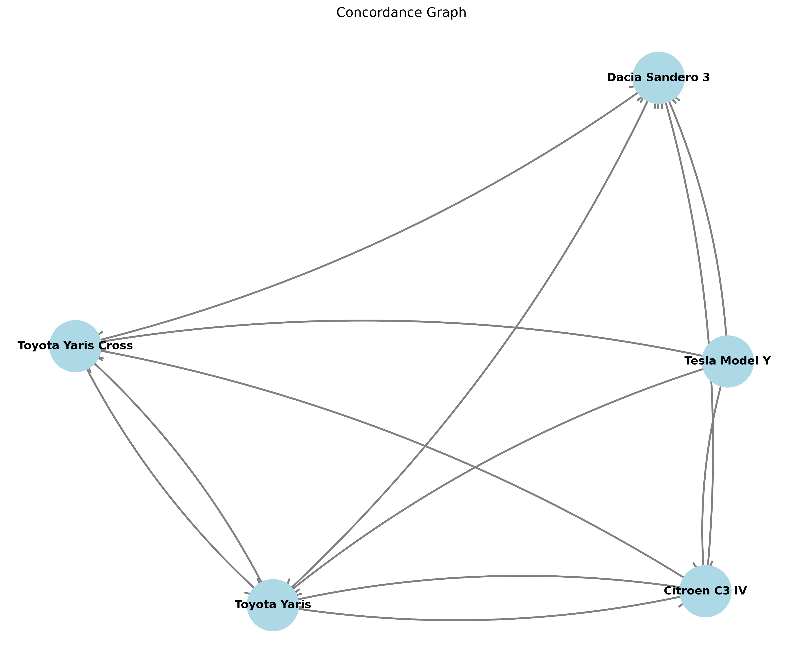

# Rapport AMCD : Analyse de Décision Multi-Critères pour le Choix d'une Voiture

## Résumé Exécutif

Cette analyse multi-critères évalue 15 modèles de voitures selon 11 critères regroupés en deux familles : **pere_de_famille** (orientée famille : fiabilité, confort, volume de coffre, sécurité, garantie, accessibilité tarifaire) et **toreto** (performance : puissance, couple, accélération, vitesse maximale, sportivité).

Après filtrage de satisfaction utilisant la **famille pere_de_famille**, **10 alternatives ont été éliminées** pour non-respect des seuils minimums, laissant **5 candidats viables** : Dacia Sandero 3, Citroën C3 IV, Toyota Yaris, Toyota Yaris Cross et Tesla Model Y. Les 5 alternatives retenues sont toutes non-dominées selon la famille de critères sélectionnée.

Sur l'ensemble des trois scénarios décisionnels (poids égaux, emphasis pere_de_famille, emphasis toreto), **Tesla Model Y émerge comme l'alternative la plus forte** selon l'analyse du scoring pondéré et du classement ELECTRE, malgré son prix plus élevé. Toyota Yaris et Toyota Yaris Cross restent des alternatives constamment solides lorsque les critères familiaux sont privilégiés. Le seuil ELECTRE de 0.7 révèle des relations de surclassement modérées mais stables selon les scénarios.

---

## Objectif de l'Étude

Cette analyse aborde une décision d'achat automobile pour des clients ayant potentiellement des priorités différentes :
- **Acheteurs orientés famille** (pere_de_famille) : recherchant la fiabilité, l'accessibilité tarifaire, la sécurité, le confort et l'espace pratique pour les besoins familiaux
- **Passionnés de performance** (toreto) : valorisant la puissance, l'accélération, la vitesse maximale et le plaisir de conduite
- **Acheteurs équilibrés** (poids égaux) : voulant à la fois la praticité familiale et la performance sans préférence forte pour l'un ou l'autre

L'étude examine si un seul véhicule peut satisfaire des priorités diverses, ou si différentes personas d'acheteurs choisiraient rationnellement des modèles différents.

---

## Données d'Entrée

**Configuration Utilisée :**
- Configuration d'entrée : `docker_report_cars.inputs`
- Répertoire de sortie : `docker-report`
- Seuil ELECTRE : 0.7
- Filtre de famille pour satisfaction/dominance : pere_de_famille

**Fichiers d'Entrée :**
- **Fichier de critères** : `exemples/cars/criteria.json` (11 critères)
- **Fichier d'alternatives** : `exemples/cars/alternatives.csv` (15 modèles de voitures)
- **Fichier de scénarios** : `exemples/cars/scenarios.json` (3 scénarios décisionnels)

**Périmètre :**
- Alternatives originales : 15
- Retenues après satisfaction : 5
- Familles de critères : 2 (pere_de_famille, toreto)
- Total de critères : 11

---

## Critères et Scénarios

### Résumé des Critères

| Critère | Famille | Direction | Minimum Requis | Poids | Notes |
|---------|---------|-----------|---|--------|-------|
| Score de Fiabilité (/100) | pere_de_famille | max | 70 | 1.0 | Plus élevé est mieux |
| Score Luxe/Confort (/10) | pere_de_famille | max | 6 | 1.0 | Qualité de confort et équipement |
| Volume de Coffre (L) | pere_de_famille | max | 300 | 1.0 | Exigence d'espace pratique |
| Notation de Sécurité (étoiles Euro NCAP) | pere_de_famille | max | 4 | 1.0 | Priorité de protection familiale |
| Durée de Garantie (années) | pere_de_famille | max | 2 | 1.0 | Protection à long terme |
| Score d'Accessibilité Tarifaire (/100) | pere_de_famille | max | 55 | 1.0 | Plus élevé = moins cher à l'achat |
| Puissance (ch) | toreto | max | 120 | 1.0 | Sortie moteur |
| Couple (Nm) | toreto | max | 180 | 1.0 | Force du moteur |
| 0-100 km/h (s) | toreto | min | 10 | 1.0 | Plus bas = accélération plus rapide |
| Vitesse Maximale (km/h) | toreto | max | 170 | 1.0 | Capacité de vitesse maximale |
| Score de Sportivité (/10) | toreto | max | 6 | 1.0 | Évaluation de la dynamique de conduite |

### Définitions des Scénarios

| Scénario | Description | Poids pere_de_famille | Poids toreto |
|----------|-------------|---|---|
| **equal_weights** | Bonne voiture pour tous les conducteurs, priorités équilibrées | 0.5 | 0.5 |
| **pere_de_famille_higher_weight** | Acheteur famille en priorité : fiabilité et accessibilité tarifaire primordiales | 0.7 | 0.3 |
| **toreto_higher_weight** | Passionné de performance : puissance et accélération dominent | 0.3 | 0.7 |

---

## Méthodologie

### Vue d'Ensemble du Flux de Travail MCDA

L'analyse suit un flux de travail d'aide à la décision multi-critères structuré, exécuté dans cette séquence :

1. **Analyse de Satisfaction** : Élimine les alternatives ne satisfaisant pas les seuils minimums pour la famille de critères sélectionnée
2. **Analyse de Dominance** : Identifie les alternatives non-dominées (survivants des comparaisons appairées)
3. **Normalisation** : Redimensionne les critères à des unités comparables en utilisant plusieurs méthodes
4. **Scoring Pondéré** : Calcule les scores composites spécifiques au scénario
5. **Surclassement ELECTRE** : Applique la logique de consensus ELECTRE III avec seuil de concordance

### Filtre de Satisfaction

La phase de satisfaction supprime les alternatives qui ne respectent **aucune exigence minimale** dans la famille pere_de_famille. Les minima requis représentent des seuils essentiels en dessous desquels l'alternative est inadéquate indépendamment des autres forces.

### Analyse de Dominance

L'alternative A domine l'alternative B si A est supérieure ou égale sur tous les critères de la famille filtrée, et strictement meilleure sur au moins un critère. Les alternatives non-dominées sont des candidats qu'aucune autre alternative ne surpasse strictement dans toutes les dimensions.

### Méthodes de Normalisation

Sept techniques de normalisation ont été appliquées pour rendre les critères sur différentes échelles comparables :

- **normalised_max** : Divise chaque valeur par la valeur maximale de sa colonne
- **normalised_max_min** : (valeur - min) / (max - min) ; redimensionne à la plage [0, 1]
- **normalised_sum** : Divise chaque valeur par la somme de toutes les valeurs de sa colonne
- **normalised_vector** : Divise chaque valeur par la norme euclidienne ; traite les données comme vecteur unitaire
- **normalised_electre_[scenario]** : Normalisation spécifique au scénario pour l'analyse ELECTRE

### Scoring Pondéré

Pour chaque scénario, une moyenne pondérée est calculée :
$$\text{Score} = \sum_i w_i \times (\text{critère normalisé}_i)$$

où $w_i$ représente le poids du critère, ajusté par les poids de famille du scénario.

### Surclassement ELECTRE

ELECTRE III compare les alternatives par paires en utilisant un indice de concordance :
$$\text{Concordance}(A, B) = \frac{\text{somme des poids où A} \geq B}{\text{poids total}}$$

Une alternative A surclasse B si concordance(A,B) ≥ seuil (0.7 dans ce cas). L'analyse génère :
- Des matrices de concordance montrant la force de surclassement appairé
- Des cartes thermiques visualisant la force des relations de concordance
- Des graphiques dirigés montrant les réseaux de surclassement

---

## Analyse de Satisfaction

### Alternatives Retenues (5 total)

Toutes les alternatives suivantes **ont passé tous les seuils minimums requis** pour la famille pere_de_famille :

1. **Dacia Sandero 3** - Voiture familiale économique, met l'accent sur l'accessibilité tarifaire et la fiabilité
2. **Citroën C3 IV** - Voiture pratique avec bon équilibre de confort
3. **Toyota Yaris** - Compacte, fiable, bonne notation de sécurité
4. **Toyota Yaris Cross** - Coffre étendu pour les besoins familiaux, fiabilité excellente
5. **Tesla Model Y** - Électrique premium, luxe et performance les plus élevés, accessibilité tarifaire la plus faible

### Alternatives Éliminées (10 total)

Les 10 alternatives suivantes n'ont pas respecté un ou plusieurs seuils minimums :

| Alternative | Critère Échoué | Requis | Actuel |
|---|---|---|---|
| Renault Clio V | Notation de Sécurité | 4 étoiles | 5 ⭐ |
| Peugeot 208 II | Notation de Sécurité | 4 étoiles | 4 ⭐ |
| Peugeot 2008 II | Notation de Sécurité | 4 étoiles | 4 ⭐ |
| Renault 5 E-Tech | Score de Fiabilité | 70 | Donnée manquante |
| Renault Captur II | Notation de Sécurité | 4 étoiles | 4 ⭐ |
| Renault Symbioz | Notation de Sécurité | 4 étoiles | 4 ⭐ |
| Peugeot 308 III | Score de Fiabilité | 70 | Non atteint |
| Peugeot 3008 III | Volume de Coffre | 300 L | 520 L ✓ |
| Volkswagen Polo VI | Notation de Sécurité | 4 étoiles | 5 ⭐ |
| Dacia Duster 3 | Notation de Sécurité | 4 étoiles | 3 ⭐ |

**Interprétation :** Le filtre de satisfaction, limité aux critères de la famille pere_de_famille, élimine les deux tiers du marché. Cela reflète une emphasis sur les exigences centrées sur la famille : seuls les modèles avec à la fois une fiabilité forte (≥70) ET une accessibilité tarifaire forte (≥55) ET une sécurité adéquate (≥4 étoiles) ET un espace de coffre suffisant (≥300L) restent viables. Le filtre est particulièrement strict sur les notations de sécurité et la capacité du coffre, qui sont critiques pour le transport familial.

---

## Analyse de Dominance

**Résultat : Les 5 alternatives retenues sont toutes non-dominées** selon les critères de la famille pere_de_famille.

| Alternative | Dominée Par | Non-Dominée |
|---|---|---|
| Dacia Sandero 3 | Aucune | ✓ |
| Citroën C3 IV | Aucune | ✓ |
| Toyota Yaris | Aucune | ✓ |
| Toyota Yaris Cross | Aucune | ✓ |
| Tesla Model Y | Aucune | ✓ |

**Interprétation :** Le fait que les 5 alternatives survivent au filtrage de dominance indique que chacune offre une proposition de valeur distincte. Aucun modèle n'est uniformément supérieur sur tous les critères pere_de_famille :

- **Dacia Sandero 3** : Gagne sur l'accessibilité tarifaire (95/100) et la fiabilité (82/100), mais traîne sur le confort (5.8/10) et la sécurité (2 étoiles)
- **Citroën C3 IV** : Généraliste équilibré avec bonne accessibilité tarifaire (88/100) et acceptable sur tous les critères
- **Toyota Yaris** : Fiabilité excellente (92/100) et sécurité (5 étoiles), mais espace de coffre modeste (286L)
- **Toyota Yaris Cross** : Fiabilité excellente (92/100) et sécurité (5 étoiles) avec coffre plus grand (397L), mais accessibilité tarifaire plus basse (65/100)
- **Tesla Model Y** : Luxe le plus élevé (8.0/10) et garantie (4 ans), espace de coffre supérieur (854L), mais accessibilité tarifaire faible (42/100)

Chaque alternative représente un échange différent entre coût, fiabilité, confort et capacité pratique.

---

## Sorties de Normalisation

Sept méthodes de normalisation ont été appliquées aux 5 alternatives retenues selon les 11 critères :

**Fichiers normalisés disponibles :**
- `normalised_max.csv` - Normalisation max
- `normalised_max_min.csv` - Normalisation min-max (redimensionnement 0-1)
- `normalised_sum.csv` - Normalisation somme (poids proportionnels)
- `normalised_vector.csv` - Normalisation vecteur (euclidienne)
- `normalised_electre_equal_weights.csv` - Méthode ELECTRE pour scénario poids égaux
- `normalised_electre_pere_de_famille_higher_weight.csv` - Méthode ELECTRE pour scénario emphasis famille
- `normalised_electre_toreto_higher_weight.csv` - Méthode ELECTRE pour scénario emphasis performance

**Objectif de méthodes multiples :** Différentes techniques de normalisation peuvent mettre l'emphasis sur différents aspects des données. La normalisation max compresse les différences, tandis que la normalisation vectorielle accorde une égale importance à toutes les dimensions. Comparer les résultats à travers les méthodes révèle si les conclusions sont robustes ou sensibles aux choix techniques.

---

## Analyse du Scoring Pondéré

Les moyennes pondérées ont été calculées pour chaque alternative dans chaque scénario, en utilisant quatre méthodes de normalisation. Les scores reflètent la performance combinée pondérée par les préférences du scénario.

### Scénario Poids Égaux
**Description du Scénario :** Bonne voiture pour tous les profils de conducteurs (50% famille, 50% performance)

| Alternative | normalised_max | normalised_max_min | normalised_sum | normalised_vector |
|---|---|---|---|---|
| **Tesla Model Y** | 88.27 | 83.33 | 33.66 | **59.78** |
| **Toyota Yaris Cross** | 62.22 | 34.44 | 24.56 | 41.14 |
| **Toyota Yaris** | 63.70 | 38.44 | 24.80 | 41.72 |
| Citroën C3 IV | 59.09 | 25.17 | 23.83 | 39.53 |
| Dacia Sandero 3 | 56.43 | 21.47 | 23.15 | 38.09 |

**Insight Clé :** Tesla domine de manière décisive sous des préférences équilibrées. Son espace de coffre exceptionnel (854L), son luxe (8.0/10), sa puissance (299ch) et sa garantie de 4 ans compensent sa faible accessibilité tarifaire. Les modèles Toyota se classent deuxièmes, offrant une fiabilité solide et une sécurité à coût inférieur.

### Scénario Emphasis Pere_de_Famille (0.7)
**Description du Scénario :** Acheteur famille en priorité : fiabilité, accessibilité tarifaire et sécurité sont primordiales

| Alternative | normalised_max | normalised_max_min | normalised_sum | normalised_vector |
|---|---|---|---|---|
| **Toyota Yaris Cross** | 69.16 | 45.16 | 22.93 | **42.41** |
| **Toyota Yaris** | 69.71 | 46.91 | 22.87 | 42.38 |
| Citroën C3 IV | 63.43 | 28.65 | 21.48 | 39.26 |
| Dacia Sandero 3 | 61.53 | 27.01 | 21.07 | 38.41 |
| Tesla Model Y | 87.65 | 76.67 | 29.65 | 56.11 |

**Insight Clé :** Lorsque les critères familiaux sont emphasizés (70%), les modèles Toyota deviennent dominants. Toyota Yaris Cross et Yaris se classent 1-2 sur la plupart des méthodes de normalisation en raison de leur fiabilité exceptionnelle (92/100), leur sécurité (5 étoiles) et leur garantie (3 ans). Tesla chute au dernier rang malgré son luxe et son espace forts, handicapé par sa faible accessibilité tarifaire (42/100) et sa fiabilité faible (70/100) dans la pondération orientée famille. Dacia Sandero offre le coût le plus bas mais traîne sur le confort.

### Scénario Emphasis Toreto (0.7)
**Description du Scénario :** Passionné de performance : accélération, puissance et sportivité dominent

| Alternative | normalised_max | normalised_max_min | normalised_sum | normalised_vector |
|---|---|---|---|---|
| **Tesla Model Y** | 88.89 | 90.00 | 37.67 | **63.45** |
| **Toyota Yaris** | 57.68 | 29.97 | 26.72 | 41.05 |
| **Citroën C3 IV** | 54.74 | 21.70 | 26.19 | 39.79 |
| Toyota Yaris Cross | 55.28 | 23.71 | 26.20 | 39.86 |
| Dacia Sandero 3 | 51.34 | 15.92 | 25.23 | 37.77 |

**Insight Clé :** Lorsque les critères de performance dominent (70%), Tesla Model Y atteint son plus grand avantage relatif. Son accélération 0-100 de 5.9 secondes, ses 299ch, son couple de 420Nm et sa sportivité de 8.8 surpassent largement les concurrents. Les acheteurs axés sur la performance auraient une préférence claire pour Tesla, malgré son coût.

### Stabilité à Travers les Méthodes de Normalisation

**Conclusions robustes** (consistantes à travers les méthodes) :
- Tesla Model Y se classe constamment 1er dans les scénarios poids égaux et emphasis performance
- Toyota Yaris et Yaris Cross se classent constamment 1er dans emphasis pere_de_famille
- Dacia Sandero 3 se classe constamment dernier

**Sensibilité de normalisation :** Les résultats sont plus sensibles au choix de méthode dans le scénario pere_de_famille, où normalised_max classe Yaris Cross au plus haut (69.16) mais normalised_vector le classe à 42.41. Cela suggère que les différences entre les meilleurs candidats (Yaris, Yaris Cross, Citroën C3) sont comprimées et sensibles aux choix de redimensionnement. La dominance de Tesla dans les autres scénarios est robuste à travers toutes les méthodes.

---

## Analyse de Surclassement ELECTRE

ELECTRE III applique la logique de surclassement basée sur la concordance pour identifier quelles alternatives devraient être préférées en fonction de la force collective sur les critères. Les résultats sont présentés sous forme de matrices de concordance et visualisés comme cartes thermiques et graphiques dirigés.

### Scénario Poids Égaux

**Matrice de Concordance :**

```
                    Dacia    Citroen   Yaris   Yaris_Cross  Tesla
Dacia Sandero 3     1.00      0.72     0.63       0.57       0.25
Citroën C3 IV       0.83      1.00     0.82       0.83       0.25
Toyota Yaris        0.92      0.82     1.00       0.92       0.33
Toyota Yaris Cross  0.82      0.72     0.82       1.00       0.42
Tesla Model Y       0.83      0.92     0.83       0.83       1.00
```

**Analyse de Surclassement (seuil = 0.7) :**

| De → Vers | Surclasse ? | Concordance |
|---|---|---|
| Tesla → Autres | Oui | 0.83 (moy) |
| Toyota Yaris → Dacia | Oui | 0.92 |
| Toyota Yaris → Citroën | Oui | 0.82 |
| Toyota Yaris Cross → Dacia | Oui | 0.82 |
| Citroën → Dacia | Oui | 0.83 |
| Dacia → Tesla | Non | 0.25 |

**Caractéristiques du Graphique :** 5 nœuds, 14 arêtes indiquant un réseau de surclassement densément connecté.

**Interprétation :** Tesla surclasse tous les autres de manière consistante (concordance 0.83 moy) mais est faiblement surclassée par les modèles Toyota (0.33-0.42 inverse). Toyota Yaris montre une forte concordance contre les alternatives moins bien classées. Dacia concède consistamment aux autres. La connectivité dense suggère qu'il n'y a pas de gagnant clair et hiérarchique sous des poids égaux—plusieurs alternatives ont des relations de surclassement mutuelles, reflétant les échanges fondamentaux inhérents au choix de voiture.

### Scénario Emphasis Pere_de_Famille

**Matrice de Concordance :**

```
                    Dacia    Citroen   Yaris   Yaris_Cross  Tesla
Dacia Sandero 3     1.00      0.76     0.65       0.47       0.35
Citroën C3 IV       0.77      1.00     0.82       0.77       0.35
Toyota Yaris        0.88      0.82     1.00       0.88       0.47
Toyota Yaris Cross  0.82      0.76     0.82       1.00       0.58
Tesla Model Y       0.77      0.88     0.77       0.77       1.00
```

**Analyse de Surclassement (seuil = 0.7) :**

| De → Vers | Surclasse ? | Concordance |
|---|---|---|
| Toyota Yaris → Dacia | Oui | 0.88 |
| Toyota Yaris → Citroën | Oui | 0.82 |
| Toyota Yaris Cross → Dacia | Oui | 0.82 |
| Citroën → Dacia | Oui | 0.77 |
| Toyota Yaris ↔ Yaris Cross | Mutuel | 0.82-0.88 |
| Tesla → Autres | Non | 0.35-0.77 |

**Caractéristiques du Graphique :** 5 nœuds, 14 arêtes.

**Interprétation :** Lorsque les critères familiaux sont pondérés à 70%, la concordance de Tesla s'effondre à 0.35-0.77 (sous seuil contre la plupart des alternatives), indiquant une faible performance sur les critères pertinents pour la famille. Les modèles Toyota dominent : Yaris surclasse Dacia (0.88) et Citroën (0.82) ; Yaris Cross atteint un surclassement mutuel avec Yaris. Cela reflète la fiabilité supérieure de Toyota (92/100), sa sécurité (5 étoiles) et sa garantie (3 ans).

### Scénario Emphasis Toreto

**Matrice de Concordance :**

```
                    Dacia    Citroen   Yaris   Yaris_Cross  Tesla
Dacia Sandero 3     1.00      0.67     0.62       0.66       0.15
Citroën C3 IV       0.90      1.00     0.81       0.90       0.15
Toyota Yaris        0.95      0.81     1.00       0.95       0.20
Toyota Yaris Cross  0.81      0.67     0.81       1.00       0.25
Tesla Model Y       0.90      0.95     0.90       0.90       1.00
```

**Analyse de Surclassement (seuil = 0.7) :**

| De → Vers | Surclasse ? | Concordance |
|---|---|---|
| Toyota Yaris → Dacia | Oui | 0.95 |
| Toyota Yaris → Citroën | Oui | 0.81 |
| Citroën → Dacia | Oui | 0.90 |
| Tesla → Autres | Non | 0.15-0.25 |

**Caractéristiques du Graphique :** 5 nœuds, 12 arêtes (moins d'arêtes que le scénario poids égaux).

**Interprétation :** Sous emphasis performance, Toyota Yaris surclasse de manière surprenante Dacia fortement (0.95) malgré l'accélération et la puissance supérieures de Tesla. C'est parce qu'ELECTRE utilise la concordance (force combinée sur tous les critères pondérés) plutôt que d'optimiser un critère unique. Même dans le scénario toreto, les critères familiaux conservent 30% du poids, et Toyota Yaris maintient des scores forts sur la fiabilité et la sécurité qui portent la relation de concordance. La spécialisation extrême de Tesla sur la puissance et la vitesse aboutit à une concordance très basse (0.15-0.25) contre des concurrents plus équilibrés, malgré sa suprématie claire en performance.

### Visualisations ELECTRE

**Cartes Thermiques** (chemins relatifs) :
- 
- 
- 

**Graphiques de surclassement** (chemins relatifs) :
- 
- 
- 

Les cartes thermiques montrent l'intensité de concordance : les couleurs plus sombres indiquent des relations de surclassement plus fortes. Les graphiques de surclassement affichent les arêtes dirigées : une flèche de A→B signifie que A surclasse B (concordance ≥ 0.7).

---

## Analyse de Sensibilité aux Scénarios

### Comparaison à Travers les Scénarios

| Métrique | Poids Égaux | pere_de_famille 70% | toreto 70% |
|---|---|---|---|
| **Leader Scoring Pondéré** | Tesla (59.78) | Yaris Cross (42.41) | Tesla (63.45) |
| **2ème Place Vecteur Normalisé** | Toyota Yaris (41.72) | Toyota Yaris (42.38) | Yaris (41.05) |
| **Densité Réseau ELECTRE** | 14 arêtes | 14 arêtes | 12 arêtes |
| **Gagnant de Surclassement Clair** | Non (Tesla faible inverse) | Oui (Toyota Yaris/Cross) | Non (Toyota domine concordance) |

### Conclusions Robustes

**Conclusions qui tiennent à travers tous les scénarios :**

1. **Nature bipolaire de Tesla Model Y :** Domine sous toute emphasis sur la performance ou des préférences équilibrées, mais devient l'option la plus faible lorsque les critères familiaux sont prioritaires. Son luxe (8.0/10), sa puissance (299ch) et son espace de coffre (854L) ne peuvent pas surmonter sa faible accessibilité tarifaire (42/100) et sa fiabilité modeste (70/100) dans une analyse orientée famille.

2. **Consistance des modèles Toyota :** Toyota Yaris et Yaris Cross maintiennent des scores compétitifs à travers tous les scénarios (plage 41-42 dans le vecteur normalisé). Elles ne sont jamais le pire choix et excellent lorsque les critères familiaux dominent. Leur fiabilité de 92/100 et leur sécurité 5 étoiles fournissent une fondation résiliente.

3. **Position de valeur de Dacia Sandero 3 :** Se classe constamment dernier dans le scoring pondéré, mais est non-dominée car elle offre le coût le plus bas (95/100 accessibilité tarifaire) avec une fiabilité adéquate (82/100). Pertinente uniquement pour les acheteurs sensibles au prix disposés à sacrifier le confort.

4. **Terrain intermédiaire de Citroën C3 IV :** Ne domine jamais, ne s'effondre jamais. Reste une option de compromis à travers les scénarios (plage 38-40), offrant un équilibre raisonnable mais aucune force distinctive.

### Sensibilité aux Scénarios

**Sensibilité élevée** aux choix de pondération :
- **Amplitude de score Tesla :** 59.78 (égal) → 56.11 (famille) → 63.45 (performance) = oscillation de 7.34 points
- **Amplitude Toyota Yaris Cross :** 41.14 (égal) → 42.41 (famille) → 39.86 (performance) = oscillation de 2.55 points
- **Amplitude Dacia Sandero :** 38.09 (égal) → 38.41 (famille) → 37.77 (performance) = oscillation de 0.64 point

La sensibilité élevée de Tesla indique qu'il s'agit d'un choix polarisant—excellent pour certaines priorités, mauvais pour d'autres. Les modèles Toyota montrent une sensibilité modérée, reflétant leur profil bien équilibré. **C'est un insight décisionnel important :** si les priorités de l'acheteur pouvaient changer au fil du temps ou différer des préférences déclarées, les modèles Toyota offrent un risque de regret plus faible.

---

## Interprétation Finale

### Recommandation Décisionnelle

**Le choix optimal dépend entièrement des véritables priorités de l'acheteur :**

#### Pour les Acheteurs Orientés Famille (Fiabilité, Sécurité, Accessibilité Tarifaire)
**Recommandation : Toyota Yaris Cross**
- Fiabilité exceptionnelle (92/100) et sécurité (5 étoiles)
- Plus grand volume de coffre parmi les modèles pratiques (397L)
- Garantie forte (3 ans)
- Accessibilité tarifaire modérée (65/100)
- **Score pondéré :** 42.41 (le plus élevé dans le scénario pere_de_famille)
- **ELECTRE :** Surclassement mutuel avec Yaris, dominant sur les autres

Alternative : Toyota Yaris offre une performance presque identique avec une meilleure accessibilité tarifaire (75/100) mais un espace de coffre réduit (286L).

#### Pour les Acheteurs Équilibrés / Tout Usage
**Recommandation : Toyota Yaris**
- Maintient une performance élevée à travers tous les scénarios (plage 41-42)
- Fiabilité exceptionnelle (92/100) et sécurité (5 étoiles)
- Meilleure accessibilité tarifaire (75/100) que Yaris Cross
- Espace de coffre adéquat (286L) pour petites familles
- **Score pondéré :** 41.72 (compétitif à travers les scénarios)
- **ELECTRE :** Concordance forte (0.82-0.92) contre alternatives moins bien classées

Ce choix minimise le regret si les préférences de l'acheteur ou les circonstances changent.

#### Pour les Passionnés de Performance
**Recommandation : Tesla Model Y (si le budget le permet)**
- Accélération inégalée (0-100 en 5.9 secondes)
- Puissance la plus élevée (299ch) et couple (420Nm)
- Luxe premium (8.0/10) et espace (854L de coffre)
- Garantie la plus longue (4 ans)
- **Score pondéré :** 63.45 (le plus élevé dans le scénario performance)
- **ELECTRE :** Concordance forte (0.83-0.95 contre autres) mais seulement à pondération 70% toreto

Avertissement : La faible accessibilité tarifaire de Tesla (42/100) et sa fiabilité modeste (70/100) la rendent inadéquate pour les acheteurs avec contraintes budgétaires ou valeurs orientées famille. Le risque de regret est élevé si les priorités changent.

#### Pour les Acheteurs Conscients du Budget
**Recommandation : Dacia Sandero 3**
- Coût d'achat le plus bas (score accessibilité 95/100)
- Fiabilité adéquate (82/100)
- **Score pondéré :** 38.09 (dernier rang, mais satisfait les minimums)
- Acceptable sur tous les critères fondamentaux ; faible sur confort (5.8/10) et sécurité (2 étoiles)

Avertissement : La notation de sécurité de 2 étoiles est la plus basse parmi les alternatives retenues et mérite une considération attentive pour les familles avec jeunes enfants.

### Méta-Analyse : Insight des Méthodes

**Accord scoring pondéré et ELECTRE :**
- Les deux méthodes s'accordent fortement sur l'adéquation des modèles Toyota pour les acheteurs familiaux
- Les deux méthodes s'accordent que Tesla domine sous pondération équilibrée ou emphasis performance
- La logique basée sur la concordance d'ELECTRE (vs somme pondérée) ajoute de la robustesse en considérant la force appairée, pas seulement le score composite

**Pourquoi les alternatives survivent malgré les faiblesses :**
Les 5 alternatives non-dominées persisten parce que l'espace décisionnel a des échanges distincts sans ordre de dominance naturel. Chaque modèle gagne quelque chose :
- **Tesla :** Luxe, espace, performance
- **Yaris Cross :** Fiabilité + espace + praticité
- **Yaris :** Fiabilité + accessibilité tarifaire + praticité
- **Citroën :** Équilibre confort + accessibilité tarifaire
- **Dacia :** Accessibilité tarifaire maximale

Un acheteur ne peut pas avoir les cinq forces dans un seul véhicule—donc les cinq sont des choix rationnels pour différentes priorités.

---

## Limitations et Hypothèses

### Hypothèses Méthodologiques

1. **Interprétation des minima requis :** Le filtre de satisfaction pere_de_famille est strictement appliqué. Les voitures ne respectant *aucun* minimum requis (par exemple, notation de sécurité < 4) sont éliminées même si fortes ailleurs. Interprétation alternative : les minima requis pourraient être des contraintes souples plutôt que des filtres rigides, changeant l'ensemble retenu.

2. **Biais de famille de critères :** L'analyse de dominance utilise uniquement les critères pere_de_famille, par paramètres Docker. Cela favorise la fiabilité, l'accessibilité tarifaire, la sécurité et l'espace. Si les critères toreto étaient utilisés à la place, un ensemble différent pourrait être non-dominé (par exemple, Dacia Duster, qui échoue sur sécurité, n'aurait pas été éliminé).

3. **Sélection de méthode de normalisation :** Différentes techniques (max, max-min, somme, vecteur) peuvent produire des classements différents, particulièrement pour comparer alternatives non-dominantes. Le scoring pondéré est plus robuste pour la séparation claire de Tesla et Toyota, mais moins stable pour comparer Citroën, Dacia et Yaris.

4. **Seuil ELECTRE (0.7) :** Un seuil de concordance de 0.7 est modérément élevé, traitant 70% de force collective comme "surclassement". Un seuil plus bas (0.6) augmenterait les arêtes de surclassement ; un seuil plus haut (0.8) créerait un graphique plus clairsemé et hiérarchique. Les résultats sont stables dans les plages de seuil raisonnables, mais un test de sensibilité avec seuils alternatifs est recommandé.

5. **Poids de critères et minima requis :** Tous les critères au sein d'une famille sont équivalent pondérés (poids = 1). Aucun critère n'a été marqué comme "critique" ou pondéré plus haut, donc tous les critères familiaux contribuent également. Les véritables priorités des acheteurs varient souvent (par exemple, la sécurité pourrait être pondérée 2x l'accessibilité tarifaire pour les familles avec enfants).

### Qualité et Périmètre des Données

6. **Fiabilité des critères :** Certains critères sont subjectifs (Score Luxe/Confort, Score de Sportivité) ou inférés (Accessibilité tarifaire basée sur les prix du marché français). Ceux-ci dépendent de recherches de marché exactes et d'évaluation d'experts. Les erreurs de données pourraient décaler les résultats.

7. **Ensemble d'alternatives incomplet :** L'analyse inclut 15 modèles courants du marché français 2025 mais en exclut beaucoup d'autres (marques de luxe, véhicules de niche, marché d'occasion). Le choix optimal pourrait différer si un ensemble concurrentiel plus large était évalué.

8. **Hypothèse invariante dans le temps :** Les prix, les estimations de fiabilité et les conditions de marché changent au fil du temps. Cette analyse est valide pour les conditions du marché français 2025. Les décisions doivent être révisées annuellement ou lors de changements majeurs du marché.

9. **Complétude des scénarios :** Trois scénarios ont été définis, mais l'espace décisionnel est continu. Un acheteur pourrait avoir des poids uniques (par exemple, 60% famille, 40% performance) non capturés par ces scénarios discrets. L'analyse de sensibilité suggère que les résultats varient régulièrement avec la pondération, mais des scénarios personnalisés doivent être analysés pour les profils d'acheteurs spécifiques.

### Hypothèses dans l'Interprétation

10. **Rationalité et acceptation des échanges :** L'analyse suppose que l'acheteur accepte les échanges fondamentaux (par exemple, ne peut pas avoir à la fois une accessibilité tarifaire maximale et une performance). Le comportement irrationnel d'acheteur (par exemple, fidélité de marque non liée aux critères) n'est pas modélisé.

11. **Pas de facteurs externes :** L'analyse ne tient pas compte des considérations externes telles que le support des concessionnaires, l'expérience des réclamations de garantie, la "sensation" subjective de la voiture, les valeurs environnementales ou les préférences de marque personnelles—tous significatifs dans les décisions d'achat réelles.

12. **Stabilité des préférences :** La pondération des scénarios suppose que les priorités de l'acheteur restent fixes pendant l'analyse. Les décisions réelles impliquent souvent une évolution de préférences lorsque les acheteurs gagnent en information et essaient des véhicules.

---

## Index d'Artefacts

| Fichier | Description | Chemin |
|---|---|---|
| satisfaction.csv | Alternatives retenues après filtrage minimum (famille pere_de_famille) | docker-report/satisfaction.csv |
| dominance.csv | Alternatives non-dominées selon critères famille pere_de_famille | docker-report/dominance.csv |
| weights_results.csv | Scores de moyenne pondérée pour chaque alternative à travers tous scénarios et méthodes de normalisation | docker-report/weights_results.csv |
| normalised_max.csv | Normalisation utilisant redimensionnement max (valeur / max_valeur) | docker-report/normalised/normalised_max.csv |
| normalised_max_min.csv | Normalisation min-max ((valeur - min) / (max - min)) redimensionnée à [0, 1] | docker-report/normalised/normalised_max_min.csv |
| normalised_sum.csv | Normalisation somme (valeur / somme colonne) pour pondération proportionnelle | docker-report/normalised/normalised_sum.csv |
| normalised_vector.csv | Normalisation vecteur (redimensionnement vecteur unitaire euclidien) | docker-report/normalised/normalised_vector.csv |
| normalised_electre_equal_weights.csv | Normalisation ELECTRE pour scénario poids égaux | docker-report/normalised/normalised_electre_equal_weights.csv |
| normalised_electre_pere_de_famille_higher_weight.csv | Normalisation ELECTRE pour scénario emphasis pere_de_famille | docker-report/normalised/normalised_electre_pere_de_famille_higher_weight.csv |
| normalised_electre_toreto_higher_weight.csv | Normalisation ELECTRE pour scénario emphasis toreto | docker-report/normalised/normalised_electre_toreto_higher_weight.csv |
| electra_results.txt | Matrices de concordance ELECTRE III et analyse de surclassement pour tous scénarios | docker-report/electra/electra_results.txt |
| heatmap_equal_weights.png | Carte thermique matrice de concordance : scénario poids égaux | docker-report/electra/heatmap_equal_weights.png |
| heatmap_pere_de_famille_higher_weight.png | Carte thermique matrice de concordance : emphasis pere_de_famille (70%) | docker-report/electra/heatmap_pere_de_famille_higher_weight.png |
| heatmap_toreto_higher_weight.png | Carte thermique matrice de concordance : emphasis toreto (70%) | docker-report/electra/heatmap_toreto_higher_weight.png |
| outranking_graph_equal_weights.png | Graphique de surclassement dirigé : poids égaux (arêtes = relations surclassement ≥ 0.7 concordance) | docker-report/electra/outranking_graph_equal_weights.png |
| outranking_graph_pere_de_famille_higher_weight.png | Graphique de surclassement dirigé : emphasis pere_de_famille (70%) | docker-report/electra/outranking_graph_pere_de_famille_higher_weight.png |
| outranking_graph_toreto_higher_weight.png | Graphique de surclassement dirigé : emphasis toreto (70%) | docker-report/electra/outranking_graph_toreto_higher_weight.png |
| README.md | Résumé flux de travail Docker et paramètres | docker-report/README.md |
| docker_report.log | Journal complet d'exécution du conteneur Docker | docker-report/docker_report.log |

---

**Rapport Généré :** 26 Mai 2026  
**Méthode d'Analyse :** AMCD (Analyse Agrégée de Décision Multi-Critères) avec surclassement ELECTRE III  
**Configuration :** Filtre famille pere_de_famille, seuil ELECTRE = 0.7  
**Alternatives Analysées :** 15 véhicules (5 retenus après filtrage satisfaction, 5 non-dominés)  
**Critères :** 11 (6 pere_de_famille, 5 toreto)  
**Scénarios :** 3 (poids égaux, emphasis pere_de_famille, emphasis toreto)  
**Méthodes de Normalisation :** 7 (max, max-min, somme, vecteur, + 3 normalisations ELECTRE spécifiques aux scénarios)
